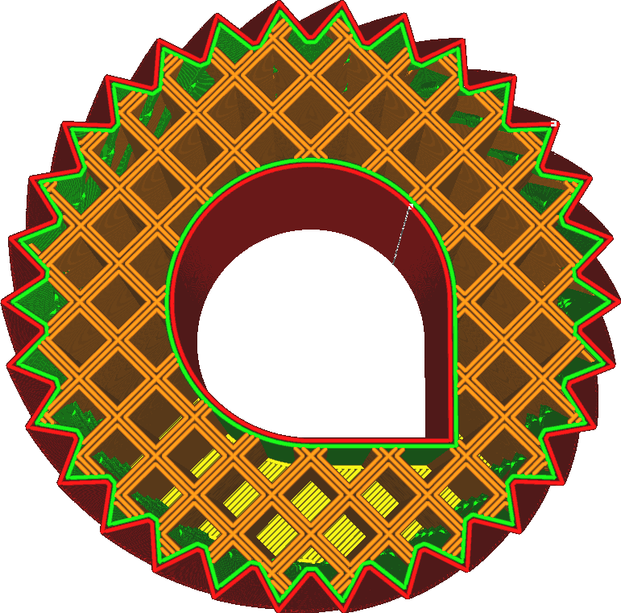

Infill Line Multiplier
====
By increasing this setting, Cura will place down more infill lines directly next to the other infill lines.

<!--screenshot {
"image_path": "infill_multiplier.png",
"models": [{"script": "gear_knurled.scad"}],
"camera_position": [18, 0, 180],
"settings": {
    "top_layers": 0,
    "infill_multiplier": 3
},
"colours": 32
}-->

This effectively increases the infill density beyond what the [Infill Density](infill_sparse_density.md) setting specifies, but instead of spacing the infill lines out evenly, the lines are placed directly adjacent to each other. Compared to simply increasing the infill density, this may increase the strength of the infill since the infill lines are able to lean on each other for extra rigidity.

When an odd multiplier is set, the original infill lines will remain in place but additional infill lines will loop around in the holes of the infill pattern. When an even multiplier is set, the original infill lines are removed and the loops are placed directly in their place.

Compared to the alternative of increasing the infill density by the same multiplier, this will have a couple of effects on your print.
* The infill becomes more rigid overall, similar to increasing the infill line width, because the infill lines are able to lean on each other when presented with shearing forces.
* The infill will shine more through the skin, reducing the surface quality.
* The gaps between infill lines are larger, since the lines are bunched together more. This makes the skin sag more and allows for pillowing.

**This setting has no effect if the infill density is 100% or higher.**