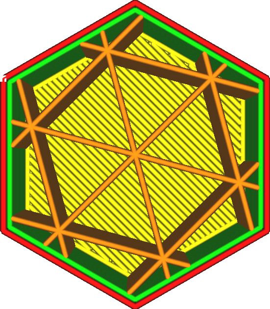
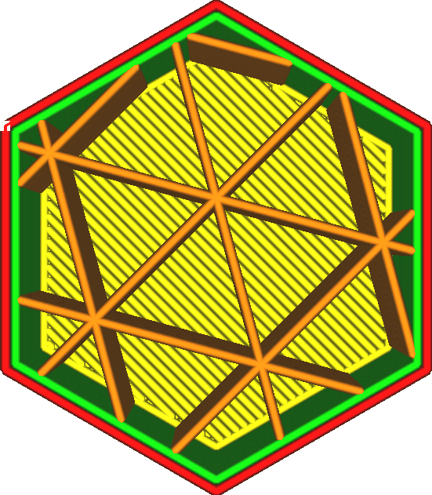

Infill Y Offset
====
Normally the infill patterns are centred on the 3D model's centre. This setting, together with the [Infill X Offset](infill_offset_x.md) allows shifting the centre of the pattern. This setting adjusts the Y coordinate of the centre.

<!--screenshot {
"image_path": "infill_offset_xy_0.png",
"models": [
    {
        "script": "hexagonal_prism.scad",
        "transformation": ["scale(0.5)"]
    }
],
"camera_position": [0, 0, 90],
"settings": {
    "top_layers": 0,
    "infill_pattern": "triangles",
    "infill_offset_x": 0
},
"colours": 64
}-->
<!--screenshot {
"image_path": "infill_offset_y_2.png",
"models": [
    {
        "script": "hexagonal_prism.scad",
        "transformation": ["scale(0.5)"]
    }
],
"camera_position": [0, 0, 90],
"settings": {
    "top_layers": 0,
    "infill_pattern": "triangles",
    "infill_offset_y": 2
},
"colours": 64
}-->

When printing with low infill density, you can use this to position the infill very precisely such that the individual infill lines are positioned where the strength is most needed.