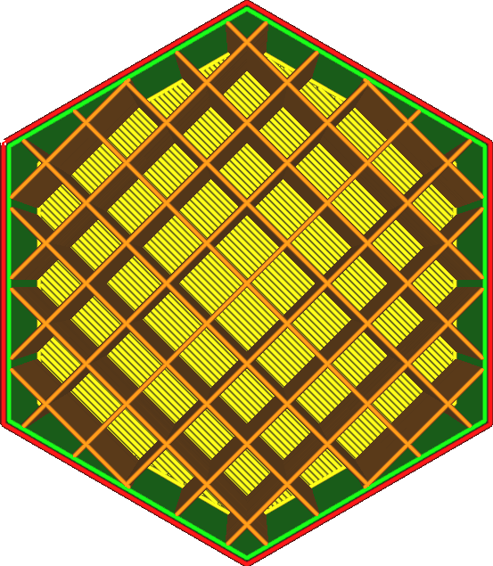

Infill Density
====
This setting configures the density of the volume inside the print, which is a major factor in the strength of the final print as well as the top surface quality. The greater the infill density, the closer the infill lines will be placed together. You can even go above 100% density, but that will result in overextrusion.

<!--screenshot {
"image_path": "infill_pattern_grid.png",
"models": [{"script": "hexagonal_prism.scad"}],
"camera_position": [0, 0, 180],
"settings": {
    "top_layers": 0,
    "infill_pattern": "grid"
},
"colours": 64
}-->
<!--screenshot {
"image_path": "infill_sparse_density_low.png",
"models": [{"script": "hexagonal_prism.scad"}],
"camera_position": [0, 0, 180],
"settings": {
    "top_layers": 0,
    "infill_sparse_density": 10
},
"colours": 64
}-->

Different densities work better with different infill patterns. Infill patterns with lots of corners and lots of crossings will not work well at great infill densities. Corners are a problem because the filament tends to drag along with the corner, creating air pockets in the outside of the corner where the material should've been deposited. Crossings are an even greater problem, because when one line crosses another its flow will get interrupted, causing underextrusion right after the crossing.

Increasing the infill density (by reducing the line distance) has a big effect on your print, namely:
* Your print will be stronger.
* The top surface will be supported better, making it smoother and more water tight.
* Reduced pillowing because the pockets of heat will be smaller.
* Your print will require more material and as a result will be heavier.
* It takes longer to print.