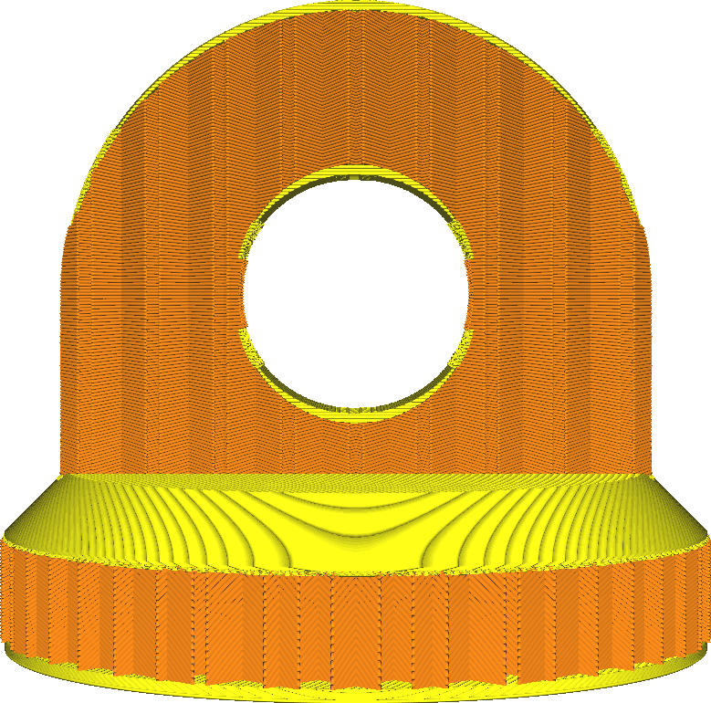
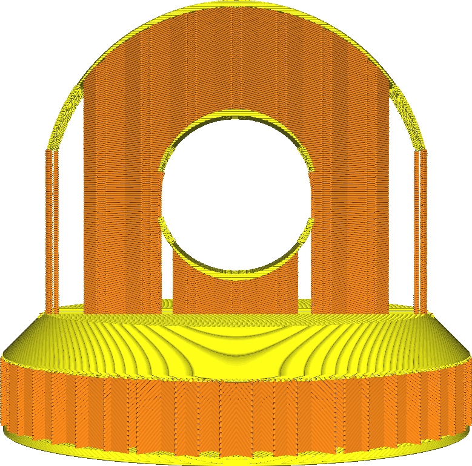

Infill Support
====
When enabled, this treats infill as support. Infill will then only generate where it is needed in order to support the top surface. It behaves as if the model is hollow and generates support inside it, but this support is generated using the infill settings.

<!--screenshot {
"image_path": "infill_support_enabled_disabled.png",
"models": [{"script": "stamp.scad"}],
"camera_position": [0, 200, 30],
"settings": {
    "wall_line_count": 0,
    "infill_support_enabled": false
},
"colours": 64
}-->
<!--screenshot {
"image_path": "infill_support_angle_low.png",
"models": [{"script": "stamp.scad"}],
"camera_position": [0, 200, 30],
"settings": {
    "wall_line_count": 0,
    "infill_support_enabled": true,
    "infill_support_angle": 40
},
"colours": 64
}-->

* This saves a lot of material on infill at very little visual cost.
* The top surfaces may sag a bit more with this enabled.
* However, the horizontal strength of the infill may be decimated. In many cases, there will be no infill behind the walls, if the walls are part of a steep slope.