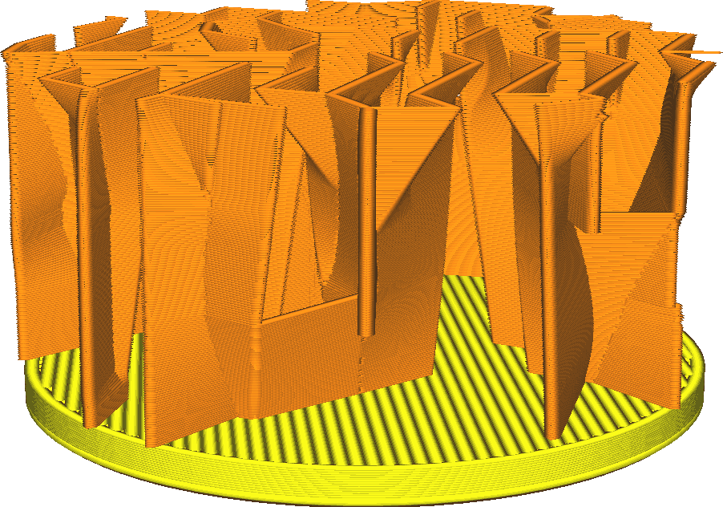
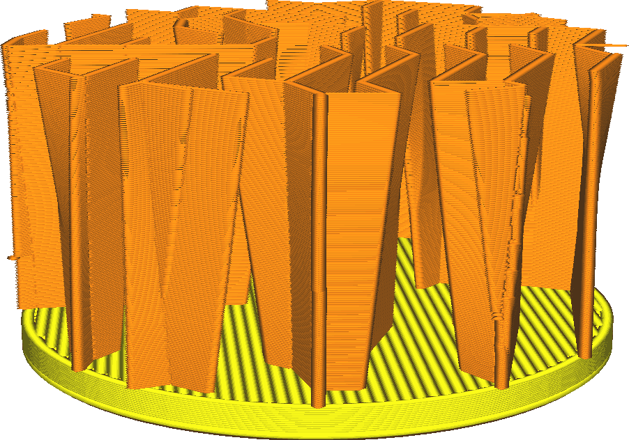

Lightning Infill Straightening Angle
====
This setting determines how steeply the Lightning infill pattern may overhang internally.

Lightning infill produces the titular lightning-like zigzag lines where it needs to support the top of the print, but those take a long time to print due to the sharp corners in the lines. So down below, it will attempt to straighten those jagged lines out, to reduce printing time. This straightening causes overhangs. The setting determines how much overhang is allowed.

<!--screenshot {
"image_path": "lightning_infill_straightening_angle_40.png",
"models": [
    {
        "script": "cylinder.scad",
        "transformation": ["scaleZ(0.5)"]
    }
],
"camera_position": [36, 44, 19],
"settings": {
    "infill_pattern": "lightning",
    "wall_line_count": 0,
    "top_layers": 0,
    "lightning_infill_support_angle": 40,
    "lightning_infill_prune_angle": 10,
    "lightning_infill_straightening_angle": 40
},
"colours": 32
}-->
<!--screenshot {
"image_path": "lightning_infill_straightening_angle_10.png",
"models": [
    {
        "script": "cylinder.scad",
        "transformation": ["scaleZ(0.5)"]
    }
],
"camera_position": [36, 44, 19],
"settings": {
    "infill_pattern": "lightning",
    "wall_line_count": 0,
    "top_layers": 0,
    "lightning_infill_support_angle": 40,
    "lightning_infill_prune_angle": 10,
    "lightning_infill_straightening_angle": 10
},
"colours": 32
}-->

Straightening quickly (increased overhang) reduces printing time somewhat, but also reduces the reliability of the print, especially with thin line width. If the overhang is too steep, this results in a layer split. The split will be on the inside of the print and often won't be a problem, but it could result in that part of infill failing completely, resulting in a part of the top side being unsupported. This will then be visible as a rough patch or pillowing on the top, or even a mess of jumbled plastic in the worst case.