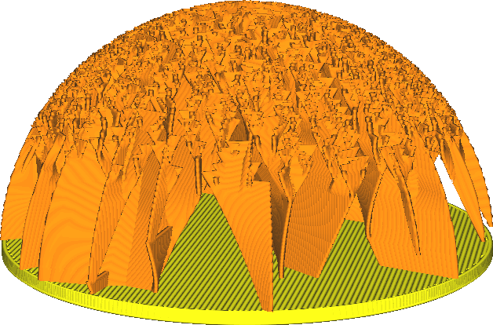
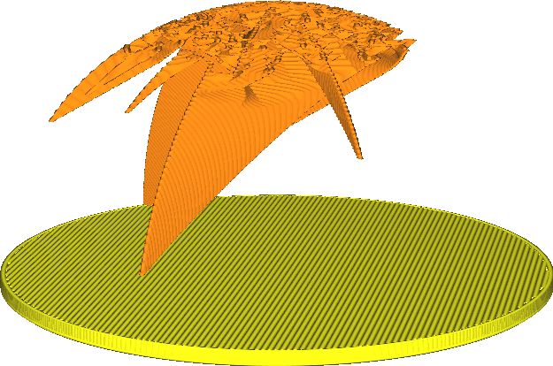

Lightning Infill Support Angle
====
The Lightning infill pattern is only intended to support the print from the inside. This setting determines the maximum angle of overhang, not only of the surfaces it will support but also internal in the infill itself. Lowering this setting causes more infill to be generated. Increasing it reduces the amount of infill.

The pattern supports the top side of the print from the inside, but only the top side that is significantly overhanging, more than this angle. The pattern also has endpoints that overhang at a certain angle to create a branching tree structure, and the sides of this branching structure have an internal angle to reach further into certain areas. These three aspects of overhang can also be individually controlled with the [Lightning Infill Overhang Angle](lightning_infill_overhang_angle.md), [Lightning Infill Prune Angle](lightning_infill_prune_angle.md) and [Lightning Infill Straightening Angle](lightning_infill_straightening_angle.md) settings respectively.

<!--screenshot {
"image_path": "lightning_infill_support_angle_30.png",
"models": [{"script": "half_sphere.scad"}],
"camera_position": [130, 87, 47],
"settings": {
    "infill_pattern": "lightning",
    "wall_line_count": 0,
    "top_layers": 0,
    "lightning_infill_support_angle": 30
},
"colours": 64
}-->
<!--screenshot {
"image_path": "lightning_infill_support_angle_60.png",
"models": [{"script": "half_sphere.scad"}],
"camera_position": [130, 87, 47],
"settings": {
    "infill_pattern": "lightning",
    "wall_line_count": 0,
    "top_layers": 0,
    "lightning_infill_support_angle": 60
},
"colours": 64
}-->

Increasing this setting will reduce the amount of material needed greatly, and reduce printing time. However it will also cause sagging. This sagging is on the inside of the model, so it is not immediately visible. However if the [Top Thickness](../top_bottom/top_thickness.md) is not sufficient, it may lead to [pillowing](../troubleshooting/pillowing.md). Because the internal angles in the infill are also allowed to overhang more, it is likely that the infill will start higher up along the walls.