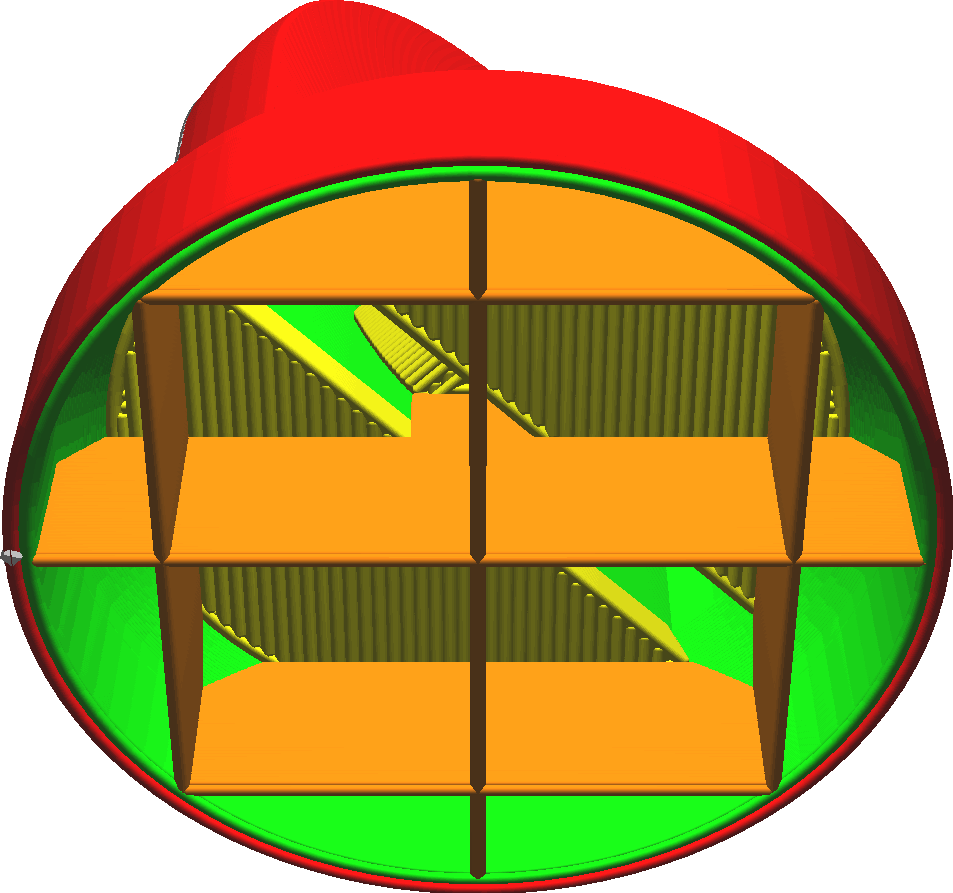
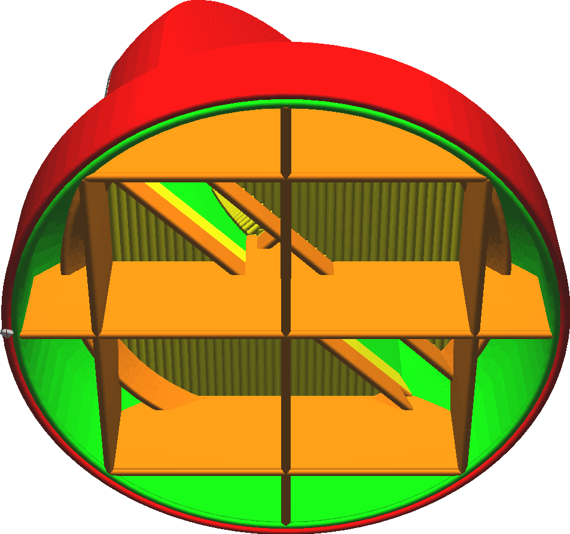

Skin Edge Support Layers
====
When printing concave shapes, there will be some top skin that ends somewhere halfway through the infill. This setting adds an extra line through the infill to support the edge of the skin, so that it sags a little bit less.

<!--screenshot {
"image_path": "skin_edge_support_thickness_0.png",
"models": [
    {
        "script": "stamp.scad",
        "transformation": ["scale(0.4)", "translateZ(-2.5)"]
    }
],
"camera_position": [-29, 29, -50],
"settings": {
    "infill_sparse_density": 10,
    "bottom_thickness": 0,
    "skin_edge_support_thickness": 0
},
"colours": 128
}-->
<!--screenshot {
"image_path": "skin_edge_support_thickness.png",
"models": [
    {
        "script": "stamp.scad",
        "transformation": ["scale(0.4)", "translateZ(-2.5)"]
    }
],
"camera_position": [-29, 29, -50],
"settings": {
    "infill_sparse_density": 10,
    "bottom_thickness": 0,
    "skin_edge_support_thickness": 1
},
"colours": 128
}-->

A single line through the gaps in the infill will still sag, so the line may be drawn on multiple layers underneath the edge of the skin that needs supporting. This setting configures the number of layers through which this line will get drawn underneath the edge of the skin. Alternatively you can adjust the [thickness](skin_edge_support_thickness.md) of the layers through which the line gets drawn.

Increasing the number of layers will generally have the following effects on the print:
* The edge of the skin will get supported better, leading to a more smooth top side because the skin can bridge completely from one side to the other.
* It takes slightly longer to print, and will use more material.

If the infill rate is high, this setting will hardly have any effect on the top surface and could cause [overextrusion](../troubleshooting/overextrusion.md) in the infill. It is best left at 0 layers then.