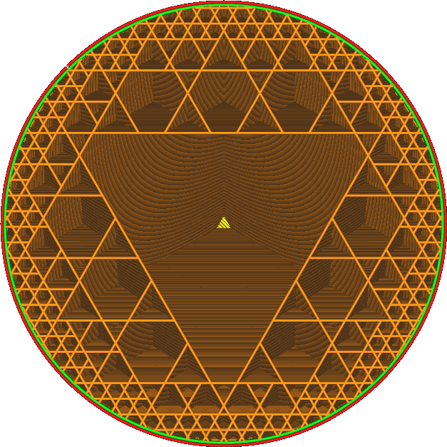

Cubic Subdivision Shell
====
This setting makes the Cubic Subdivision infill pattern start reducing infill a bit more towards the inside, to improve the strength of the print.

<!--screenshot {
"image_path": "sub_div_rad_add_small.png",
"models": [
    {
        "script": "cylinder.scad",
        "transformation": ["scale(3)"]
    }
],
"camera_position": [0, 0, 275],
"settings": {
    "infill_sparse_density": 70,
    "infill_pattern": "cubicsubdiv",
    "sub_div_rad_add": 0
},
"layer": 500,
"colours": 32
}-->
<!--screenshot {
"image_path": "sub_div_rad_add_large.png",
"models": [
    {
        "script": "cylinder.scad",
        "transformation": ["scale(3)"]
    }
],
"camera_position": [0, 0, 275],
"settings": {
    "infill_sparse_density": 70,
    "infill_pattern": "cubicsubdiv",
    "sub_div_rad_add": 5
},
"layer": 500,
"colours": 32
}-->

Cubic Subdivision works by removing the borders between eight adjacent cubes if none of the cubes touch the border of the infill volume. This setting moves that border further inside, preventing the borders between the cubes from being removed.

Effectively, this causes the Cubic Subdivision pattern to draw the maximum density more often. This increases the strength of the object, but also increases the amount of time and material it takes to print it. In the extreme, increasing this setting enough will eventually cause the Cubic Subdivision pattern to be the same as the simple Cubic pattern.

You can also set this to a negative number. This causes the borders between cubes to be removed more often, effectively reducing the amount of infill around the edges.