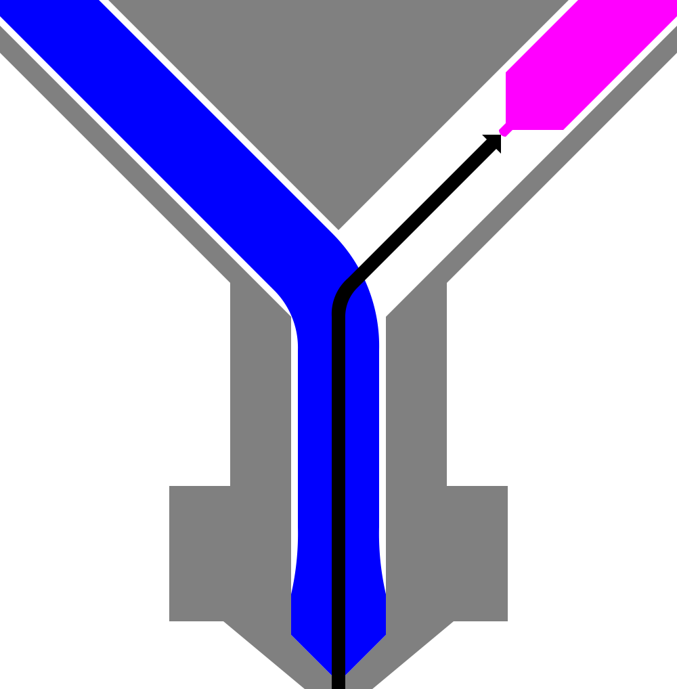

Shared Nozzle Initial Retraction
====
If the extruders of a printer [share a nozzle](machine_extruders_share_nozzle.md), Cura doesn't assume that all extruders start with the filament at the nozzle tip. This setting indicates how far away from the nozzle the filament starts. The filament may start at a different distance than the [Nozzle Switch Retraction Distance](../dual/switch_extruder_retraction_amount.md) because the filament may be stored farther away while the printer was inactive than when the extruder is standing by during the print.

Cura will use this to ensure the filament is at the nozzle tip before it starts its priming procedure for the first extruder switch.