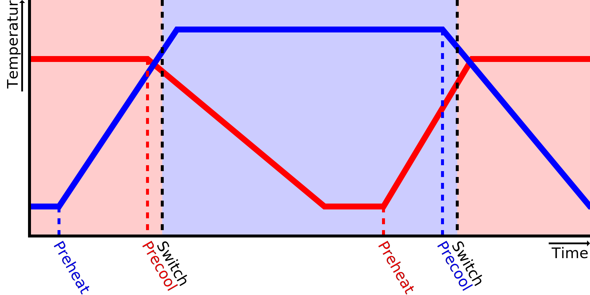

Cool Down Speed
====
This setting tells Cura how fast your nozzle cools down when it's not heated. It is used for predicting when to start pre-cooling the nozzle before switching extruders.

When switching extruders, Cura will start pre-cooling the active nozzle just before it is done, so that it will ooze a bit less while it's waiting. Cura will also try to predict how much the nozzle has cooled down while it was inactive. This way it knows how much it'll need to heat it up again afterwards.

If the nozzle actually cools down faster than what this setting indicates, the nozzle will be at the stand-by temperature faster than what Cura predicts. As a result it may take longer to heat up the nozzle than what Cura predicts, and the printer will be waiting at the nozzle switch for this nozzle to heat up further.

If the nozzle actually cools down more slowly than what this setting indicates, the nozzle may still be warm when Cura sends a command to pre-heat the nozzle, causing it to heat too fast. It will be at a printing temperature for a while before it's the nozzle's turn to print. During this time it will be oozing a bit and the plastic will degrade a bit more.

The actual cool down speed is not a constant rate in degrees per second. More likely it will depend on the difference between the current nozzle temperature and the temperature of the build volume. As such it will cool down faster when it's hot, and it will cool down more slowly as it approaches the stand-by temperature. If you're tuning this, try to tune it by measuring the time it takes to cool from the [final printing temperature](../material/material_final_print_temperature.md) to the [stand-by temperature](../material/material_standby_temperature.md). This is the most important track that Cura will attempt to predict. When making small prints, you could increase the cool down speed slightly to adjust for that it stays hot more often.

**Since this is a machine setting, this setting is not normally visible in the settings list.**