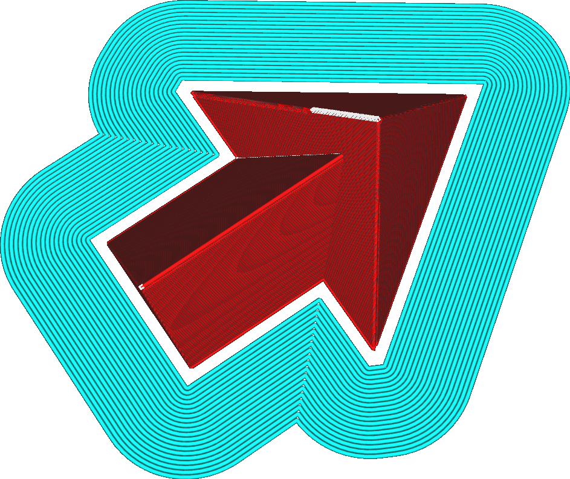

Brim Distance
====
This setting causes a gap to appear between the model and the brim. The brim lines are no longer securely adjacent to the model.

<!--screenshot {
"image_path": "brim_gap.png",
"models": [
    {
        "script": "arrow.scad",
        "transformation": ["scale(0.5)"]
    }
],
"camera_position": [-22, 32, 133],
"settings": {
    "adhesion_type": "brim",
    "brim_gap": 1
},
"colours": 32
}-->

The objective of this gap is to make it easier to remove the brim from the model. By placing the brim lines slightly apart from the actual model (on the order of half a line width), the connection between the brim and the model becomes weaker than one layer, which helps to tear off the brim by hand. It will also reduce the scar or elephant's foot left by the brim after removal. This is especially effective at greater [initial layer height](../resolution/layer_height_0.md), since the thick brim tends to be harder to remove then.

On the flip side, this also reduces the effectiveness of the brim to keep the model stuck to the build plate. Through a thinner contact area the brim will not be able to exert a lot of force on the model to keep it down against the effect of [warping](../troubleshooting/warping.md).