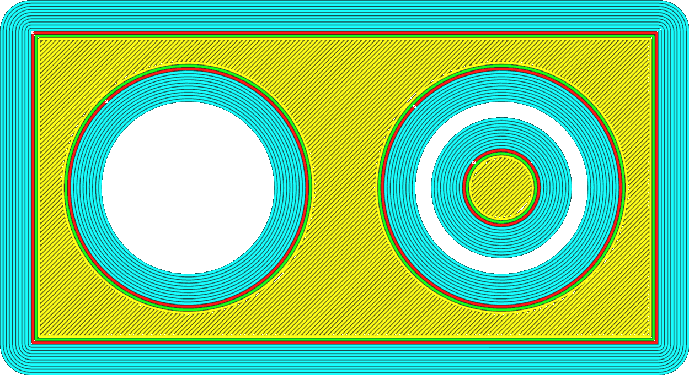
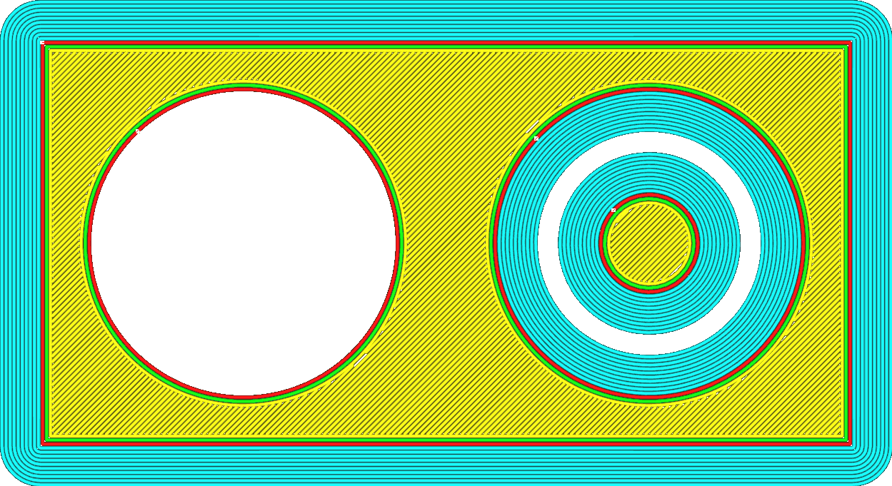

Brim Only on Outside
====
If your model has holes in the initial layer on the build plate, this setting will prevent a brim from being printed along the inside of the hole.

<!--screenshot {
"image_path": "brim_outside_only_original.png",
"models": [{"script": "holes_in_panel.scad"}],
"camera_position": [0, 0, 180],
"settings": {
    "adhesion_type": "brim",
    "brim_line_count": 10,
    "brim_outside_only": false
},
"layer": 1,
"colours": 32
}-->
<!--screenshot {
"image_path": "brim_outside_only_enabled.png",
"models": [{"script": "holes_in_panel.scad"}],
"camera_position": [0, 0, 180],
"settings": {
    "adhesion_type": "brim",
    "brim_line_count": 10,
    "brim_outside_only": true
},
"layer": 1,
"colours": 32
}-->

The brim on the inside typically adds very little extra adhesion strength between the print and the build plate and has no effect on preventing shrinking. Removing the brim on the inside may save you some time after the print is completed, because you won't need to remove the brim from the inside holes.

**If there is another object inside the hole, the brim cannot be removed due to technical limitations.**