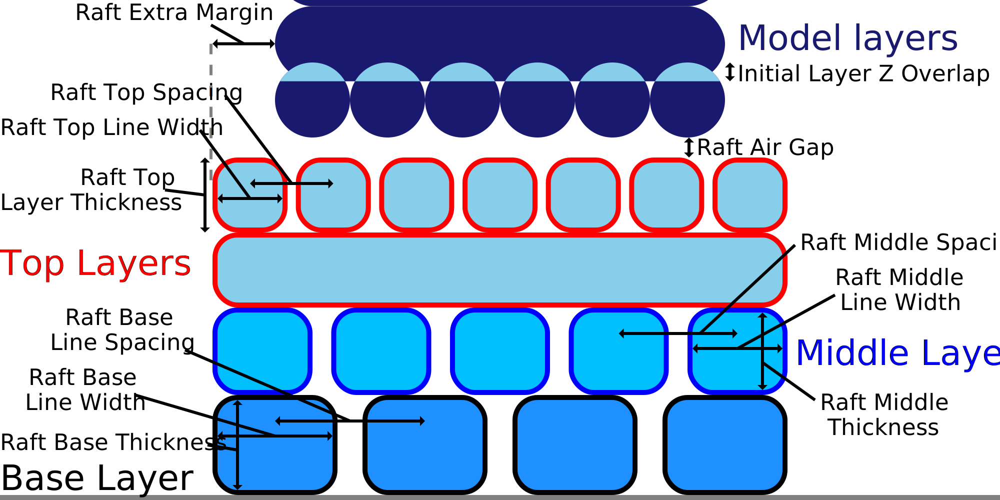

Raft Middle Line Width
====
This setting configures the width of the lines in the middle layer of the raft.

Having wider lines increases the stiffness of the raft. For some materials that warp a lot, this makes it easier to remove the raft. For others, it makes it harder, because you want to bend the raft in order to remove it.