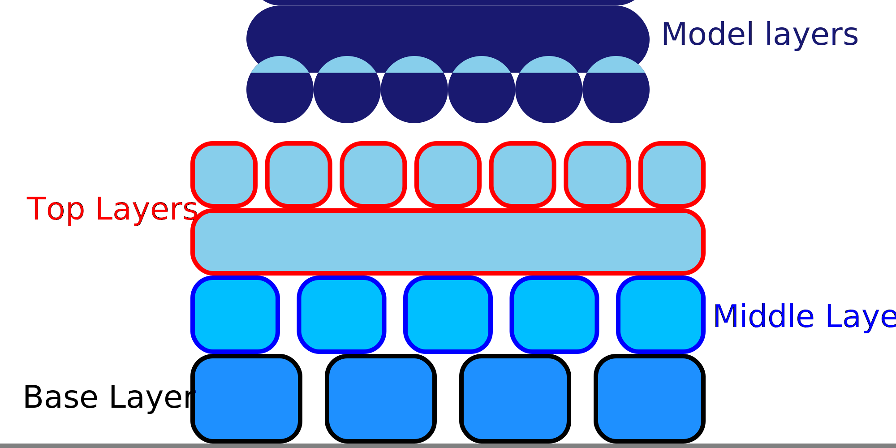

Raft Top Print Jerk
====
This setting configures the speed at which the print head can go through corners while the the top layers of the raft are being printed. The jerk rate during the top layers of the raft can be configured separately from the base and middle layers.

Since the raft generally consists of long line segments, increasing the jerk rate normally has very little impact on printing time. Increasing the jerk rate will save a bit of time when going through corners at the end of the lines though.

Increasing the jerk rate will cause the printer to vibrate more while printing the raft. This will worsen the smoothness of the top surface of the raft, which in turn makes the bottom side of the print resting on the raft less smooth.