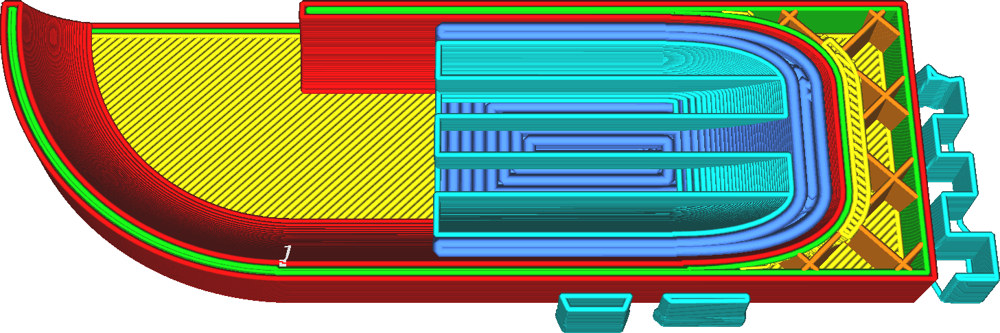

Support Floor Line Width
====
This setting adjusts the width of the lines of the bottom side of the support.

<!--screenshot {
"image_path": "support_bottom_line_width.png",
"models": [
    {
        "script": "gutter_lift.scad",
        "transformation": ["mirrorZ", "scale(0.5)"]
    }
],
"camera_position": [-45, 0, 104],
"camera_lookat": [0, 0, 3],
"settings": {
    "support_enable": true,
    "support_bottom_enable": true,
    "support_bottom_line_width": 0.8
},
"layer": 65,
"colours": 64
}-->

Printing thinner lines tends to reduce the adhesion where the support rests on the model. However it also makes the adhesion more constant and reliable. In general, it makes for support that is easier to remove and leaves less of a scar on the object. Of course, printing thinner lines also takes more printing time.