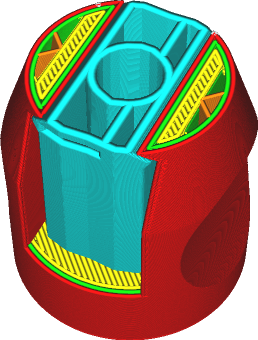

Support Line Width
====
The width of the lines with which the support is drawn can be different from the line width of the rest of the print.

<!--screenshot {
"image_path": "support_line_width.png",
"models": [
    {
        "script": "clamp.scad",
        "transformation": ["scale(0.5)"]
    }
],
"camera_position": [28, 57, 90],
"settings": {
    "support_enable": true,
    "support_line_width": 0.8
},
"layer": 350,
"colours": 128
}-->

The support generally doesn't need to be printed accurately, so it can be printed with a greater line width to save some time, without compromising the strength of the support. However, to achieve the same density for the support, the lines will be spaced further apart. This reduces the quality of the overhanging surfaces of your print.