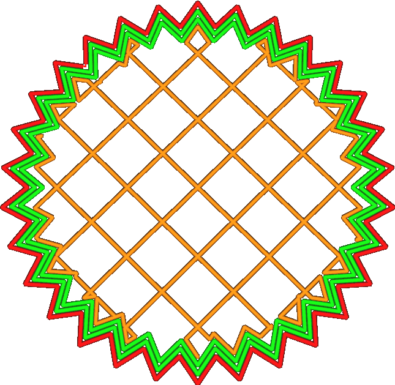

Alternate Extra Wall
====
This setting adds an extra wall every other layer. This way the infill gets wedged vertically between the walls, resulting in stronger prints.

For example, if you set the wall line count to two walls and enable alternate extra wall, it will print two walls on even numbered layers and three walls on odd numbered layers.

<!--screenshot {
"image_path": "alternate_extra_perimeter.gif",
"models": [
    {
        "script": "gear.scad",
        "transformation": ["scale(0.7)"]
    }
],
"camera_position": [0, 30, 123],
"settings": {
    "zig_zaggify_infill": true,
    "alternate_extra_perimeter": true
},
"layer": [15, 16, 17, 18],
"minimum_layer": [15, 16, 17, 18],
"colours": 32
}-->

Enabling this setting will take extra time, about half as much as adding an extra wall would. In some ways, this alternated extra wall is almost as good as a full extra wall, and in some ways it is not:
* It greatly increases the bonding between the infill and the walls, since the infill lines can also stick vertically to the extra wall above and below them. In this aspect, the extra wall punches above its weight class. It's very efficient. 
* It adds to the stiffness of the print as much as half of an extra wall. By adhering to the adjacent wall it distributes stress over more strands and provides greater arm against forces in the horizontal direction. The alternated extra wall does not have a particular advantage to do this, nor a particular disadvantage.
* A real extra wall would also add to the layer bonding strength. Walls are printed slowly, so they are a major source of layer bonding strength. However the alternated extra wall doesn't bond to the adjacent layers because it only occurs every other layer.

As a result, the alternated extra wall is an efficient way to add horizontal stiffness, but not an efficient way to add vertical toughness.