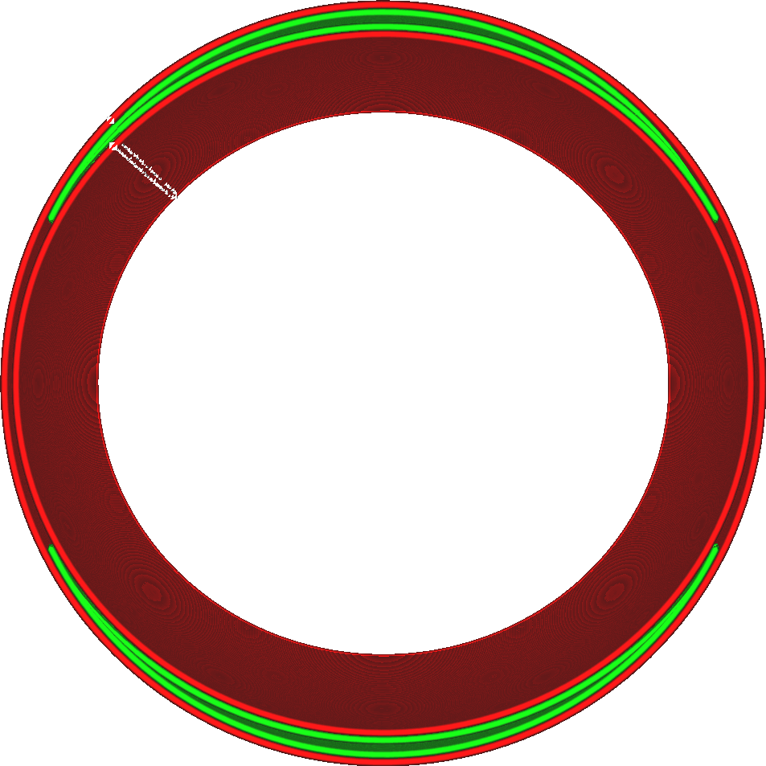
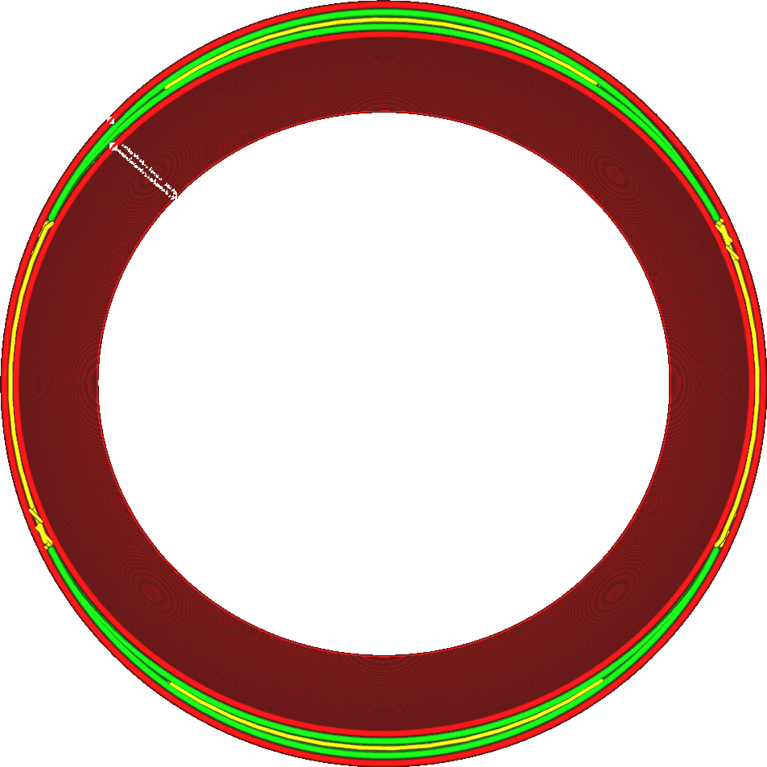

Fill Gaps Between Walls
====
Many prints contain pieces that are thinner than the desired wall thickness. In most cases that is fine, but for some prints this would leave a gap between the walls. If this setting is enabled, gaps between the walls will be filled up with a spot of extra material.

<!--screenshot {
"image_path": "fill_perimeter_gaps_disabled.png",
"models": [{"script": "spherical_cap.scad"}],
"camera_position": [0, 0, 117],
"settings": {
    "wall_line_count": 3,
    "fill_perimeter_gaps": "nowhere"
},
"colours": 64
}-->
<!--screenshot {
"image_path": "fill_perimeter_gaps_enabled.png",
"models": [{"script": "spherical_cap.scad"}],
"camera_position": [0, 0, 117],
"settings": {
    "wall_line_count": 3,
    "fill_perimeter_gaps": "everywhere"
},
"colours": 64
}-->

There are two common cases where filling gaps is useful:
* Between two opposite walls in prints that are thin (as shown in the images above). Filling these gaps increases strength of the part in those locations, because the two opposite walls are no longer able to move separately from each other.
* In very sharp corners, there will be a gap within the outer wall where the inner wall is too thick to reach into the corner. Filling these gaps increases strength but also makes the outside wall look more consistent.

**It's advisable to take good care to look which travel moves are necessary if this is enabled. The gap filling is done after the walls have completed printing.**