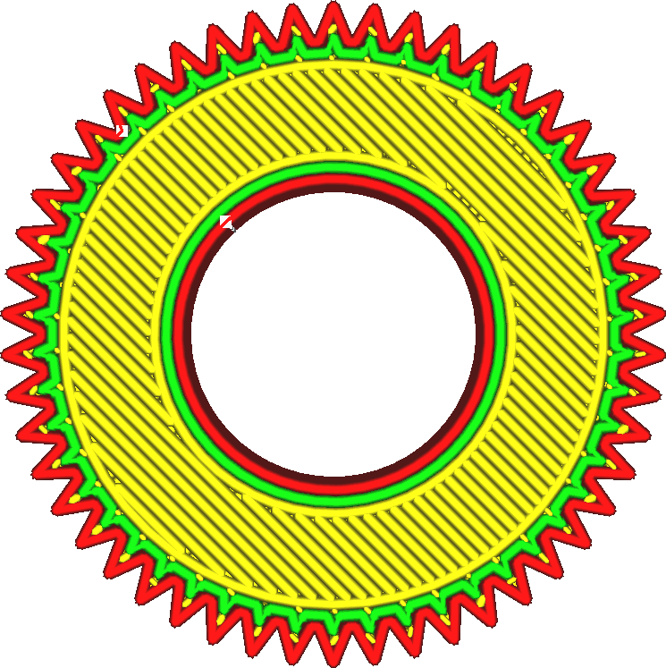
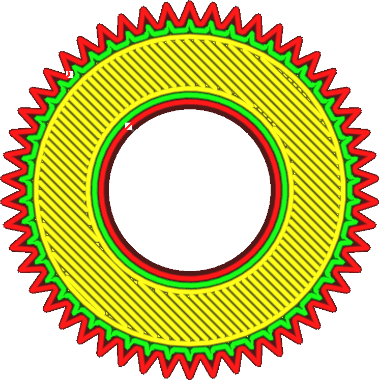

Filter Out Tiny Gaps
====
Filling gaps between walls introduces extra travel moves. If the gaps are extremely small, the material will typically not get enough time to flow out the nozzle very well. If this setting is enabled, the printer will not bother to fill some of the smallest gaps.

<!--screenshot {
"image_path": "filter_out_tiny_gaps_disabled.png",
"models": [
    {
        "script": "gear_hollow.scad",
        "scad_params": ["radius=10", "teeth_depth=1.5", "teeth=50"]
    }
],
"settings": {"filter_out_tiny_gaps": false},
"camera_position": [0, 0, 80],
"colours": 64
}-->
<!--screenshot {
"image_path": "filter_out_tiny_gaps_enabled.png",
"models": [
    {
        "script": "gear_hollow.scad",
        "scad_params": ["radius=10", "teeth_depth=1.5", "teeth=50"]
    }
],
"settings": {"filter_out_tiny_gaps": true},
"camera_position": [0, 0, 80],
"colours": 64
}-->

Gaps smaller than 2 square outer wall line widths count as "tiny" gaps. For instance, if your [Outer Wall Line Width](../resolution/wall_line_width_0.md) setting is set to 0.4mm, gaps with an area of 0.4mm * 0.4mm * 2 = 0.32mm^2 will no longer get filled.