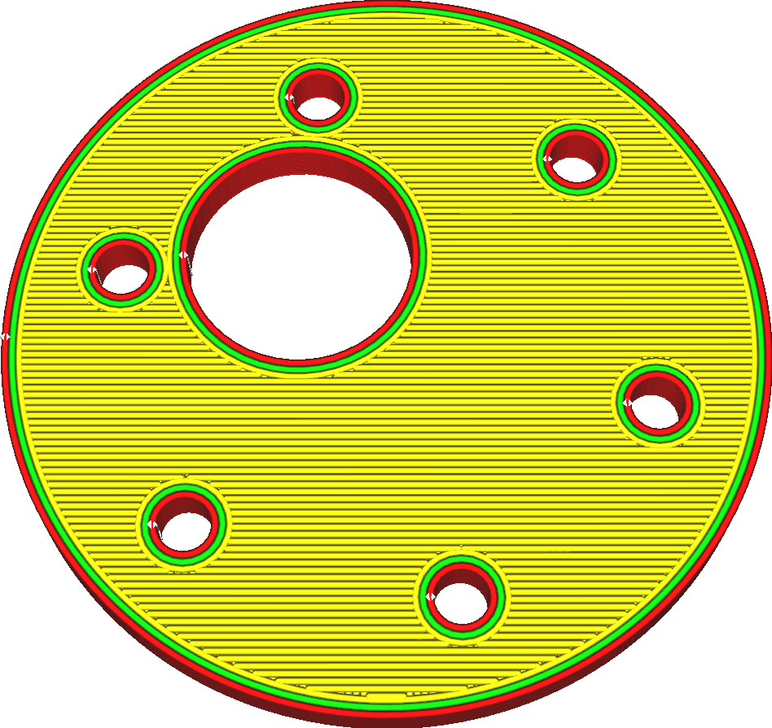
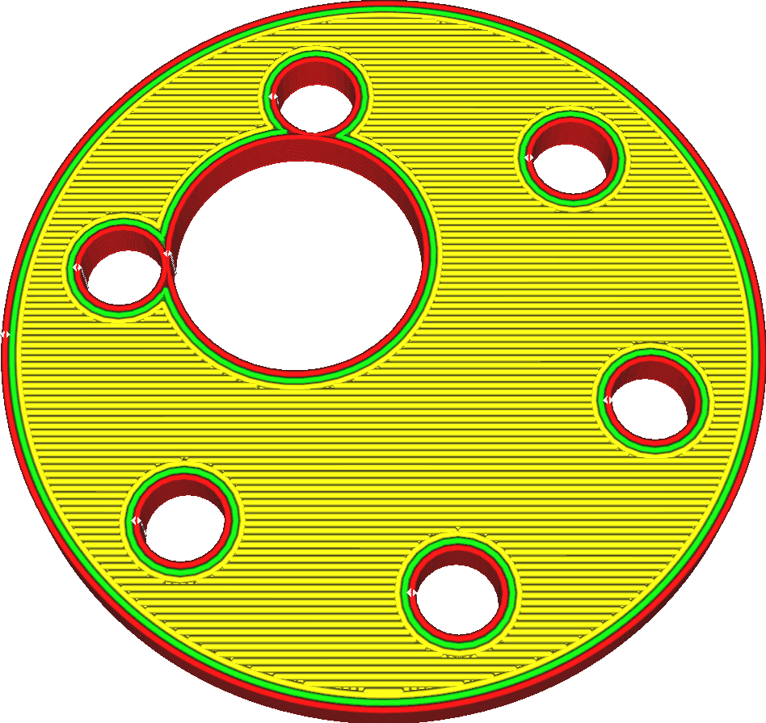

Hole Horizontal Expansion
====
This is a compensation measure for a printing effect where holes tend to end up being printed smaller than intended. With this setting you can expand the size of vertical holes in your print. Similar to the ordinary [Horizontal Expansion](xy_offset.md) setting, your print's holes will be expanded in all directions.

<!--screenshot {
"image_path": "hole_xy_offset_0.png",
"models": [{"script": "rotary_tumbler_motor_lid.scad"}],
"camera_position": [-30, 30, 111],
"settings": {"hole_xy_offset": 0},
"colours": 64
}-->
<!--screenshot {
"image_path": "hole_xy_offset.png",
"models": [{"script": "rotary_tumbler_motor_lid.scad"}],
"camera_position": [-30, 30, 111],
"settings": {"hole_xy_offset": 0.8},
"colours": 64
}-->

Due to the viscosity of the material, when printing a line of plastic in a curve, the plastic tends to get dragged along with the nozzle in the curve. This makes the curve slightly smaller than intended as the string gets pulled into the inside of the curve. Normally this isn't really visible, but when printing items that need to fit very exactly or when printing items with very small vertical holes, this becomes ruinous to the accuracy of your print. Screws won't fit any more, pieces don't slide into each other neatly any more, and so on.

This setting compensates for that by making all holes slightly bigger. Unlike [Horizontal Expansion](xy_offset.md) this only affects closed holes though. If there is even a tiny opening on one side (horizontally, on the same layer) then that part won't be considered a hole and won't be affected by this setting.

A positive value will make the holes bigger. A negative value will make the holes smaller. When combined with Horizontal Expansion, the holes are expanded first before applying the ordinary horizontal expansion. This could cause thin pieces to disappear entirely before they are expanded by the ordinary horizontal expansion.