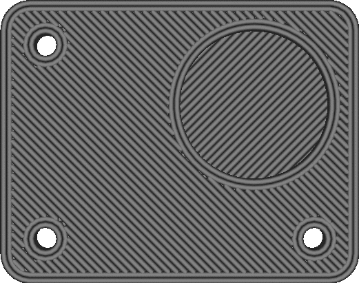

Optimize Wall Printing Order
====
If this is enabled, Cura will spend some extra slicing time to optimise the order in which the walls are printed. The goal is to reduce the number of travel moves and retractions by printing walls that surround the same part after one another.

<!--screenshot {
"image_path": "optimize_wall_printing_order_disabled.gif",
"models": [
    {
        "script": "plate_with_indent.scad",
        "transformation": ["scale(0.5)"]
    }
],
"camera_position": [0, 0, 120],
"settings": {
    "skin_outline_count": 0,
    "optimize_wall_printing_order": false
},
"layer": 37,
"line": [0, 7, 14, 21, 28, 34, 38, 42, 46, 64, 78, 91, 105, 120, 124, 128, 132, 140, 144, 148, 152, 162, 170, 178, 186, 194, 198, 202, 206, 224, 237, 251, 265, 281, 285, 289, 293, 302, 306, 310, 314],
"delay": 125,
"colours": 32
}-->
<!--screenshot {
"image_path": "optimize_wall_printing_order_enabled.gif",
"models": [
    {
        "script": "plate_with_indent.scad",
        "transformation": ["scale(0.5)"]
    }
],
"camera_position": [0, 0, 120],
"settings": {
    "skin_outline_count": 0,
    "optimize_wall_printing_order": true
},
"layer": 37,
"line": [0, 4, 8, 12, 16, 21, 25, 29, 33, 42, 46, 50, 54, 59, 63, 67, 71, 97, 110, 123, 138, 153, 166, 179, 194, 204, 208, 212, 216, 221, 225, 229, 233, 245, 252, 259, 265, 273, 281, 289, 297],
"delay": 125,
"colours": 32
}-->

If this optimisation is enabled, the nozzle will print all the walls around one part first before moving to the next part, instead of printing all of the inner walls first before printing the outer walls. Optimising is usually positive, but with some parts it may impact dimensional accuracy because the previous wall hasn't solidified yet when placing down the next one next to it.