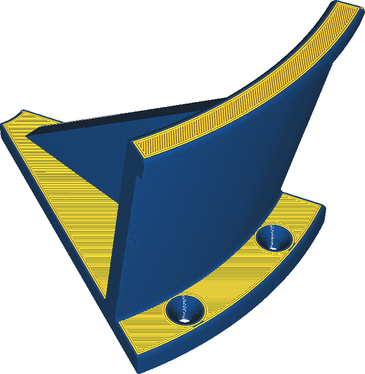

Outer Wall Extruder
====
If your printer has multiple extruders, you can choose to print just the outer wall with a different extruder.

<!--screenshot {
"image_path": "wall_0_extruder_nr.png",
"models": [{"script": "headphone_hook.scad"}],
"camera_position": [140, 140, 206],
"settings": {"wall_0_extruder_nr": 1},
"colour_scheme": "material_colour",
"colours": 32
}-->

Printing the outer wall with a different extruder can have various purposes:
* Just a visual effect by printing the outer wall with a different colour.
* The outer wall can be printed with a material that achieves better detail but has undesirable strength-properties for the infill.
* The outer wall can be printed with a flexible material to get a softer texture on your print, and to get more friction / grip.
* The outer wall can be printed with a material with a lower friction coefficient, to allow moving parts to slide more easily over the surface.

**One wall is usually not enough to cover a large colour change completely. You can expect the colour of the inner wall to shine through a bit.**