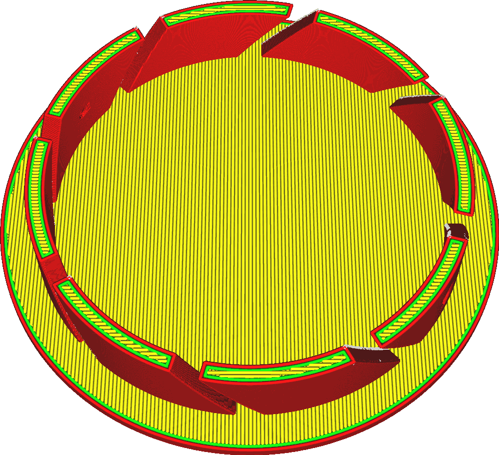
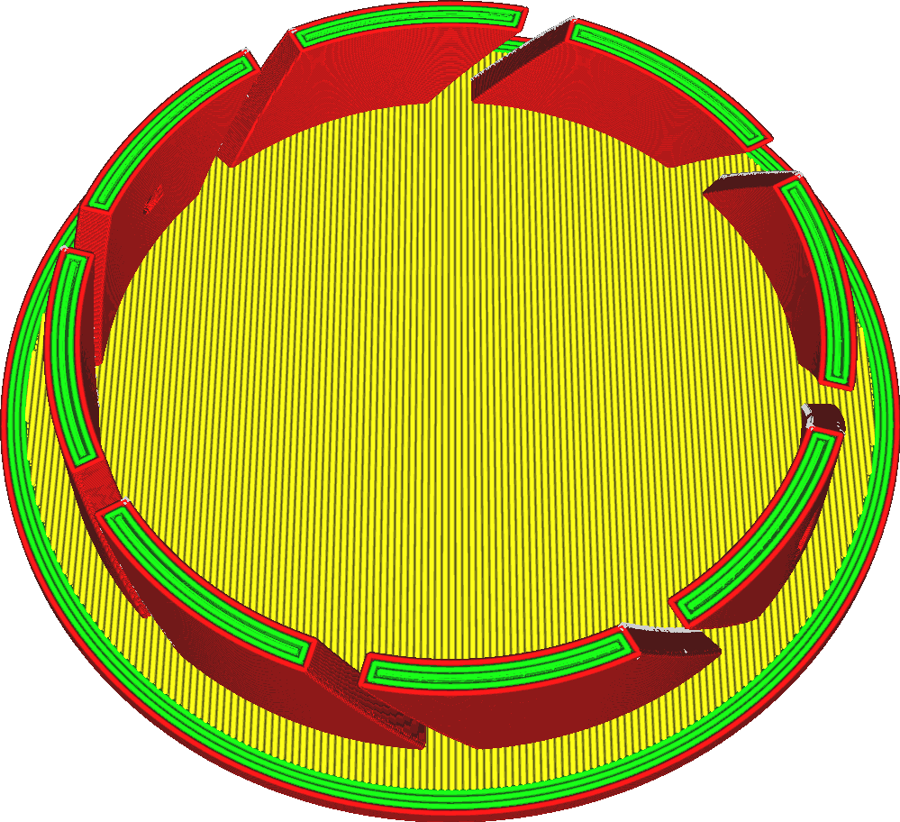

Wall Line Count
====
This setting determines how many contours will be drawn around the print on every layer.

<!--screenshot {
"image_path": "wall_thickness_0.8.png",
"models": [
    {
        "script": "rotary_tumbler_lid.scad",
        "transformation": ["scale(0.4)"]
    }
],
"camera_position": [50, 50, 124],
"settings": {
    "skin_outline_count": 0,
    "wall_line_count": 2
},
"colours": 32
}-->
<!--screenshot {
"image_path": "wall_thickness_1.6.png",
"models": [
    {
        "script": "rotary_tumbler_lid.scad",
        "transformation": ["scale(0.4)"]
    }
],
"camera_position": [50, 50, 124],
"settings": {
    "skin_outline_count": 0,
    "wall_line_count": 4
},
"colours": 32
}-->

Only one of the walls will be an outer wall, getting printed with the outer wall settings. The rest of the walls will be printed with the inner wall settings.

The number of walls is a major factor in how strong the print will be. Since the walls are adjacent, they can reinforce each other leading to a stronger part. For larger prints, this can be a much more effective way to get a strong object than adjusting the infill, depending on the shape.

Increasing the number of walls will:
* Greatly increase the strength of the print.
* Reduce the shine-through effect where the infill pattern is visible on the outside.
* Improve overhangs, because the wall lines are usually more oriented towards their nearest resting point.
* Make the model watertight more easily.
* Greatly increase the printing time and material usage of the print.