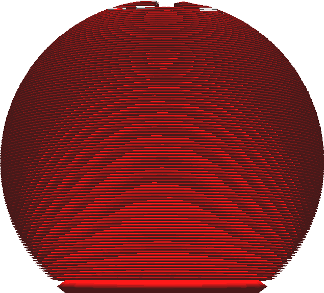
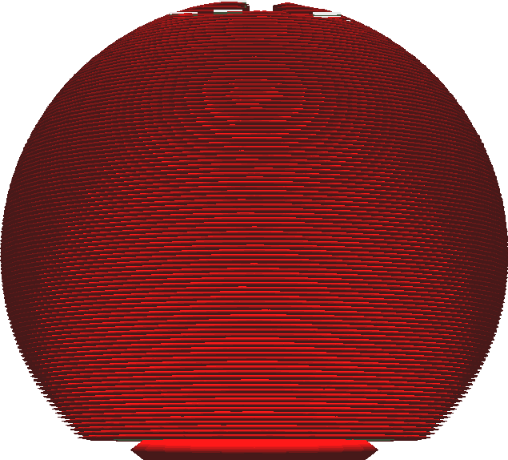

Initial Layer Horizontal Expansion
====
This setting expands only the initial layer that rests on the build plate (or on the raft). Similarly to [Horizontal Expansion](xy_offset.md), a positive value will make the initial layer wider while a negative value will shrink the initial layer.

<!--screenshot {
"image_path": "xy_offset_layer_0_original.png",
"models": [
    {
        "script": "d1.scad",
        "transformation": ["scale(0.5)"]
    }
],
"camera_position": [0, 30, 0],
"camera_lookat": [0, 0, 0],
"settings": {"xy_offset_layer_0": 0},
"colours": 16
}-->
<!--screenshot {
"image_path": "xy_offset_layer_0_enabled.png",
"models": [
    {
        "script": "d1.scad",
        "transformation": ["scale(0.5)"]
    }
],
"camera_position": [0, 30, 0],
"camera_lookat": [0, 0, 0],
"settings": {"xy_offset_layer_0": -0.6},
"colours": 16
}-->

The initial layer is often printed on a heated build plate, which keeps it in a slightly liquid state in order to improve adhesion to the build plate. The initial layer is normally also much thicker than the rest of the layers. This allows for ample time and material to let the layer sag sideways, creating a phenomenon called "elephant's foot" where the bottom side of the print has a slightly wider lip. This setting can compensate for the elephant's foot by making the initial layer slimmer in advance. Give this setting a small negative value to compensate for the elephant's foot.

You can also give this setting a large value to create a pseudo-brim around your print that can be combined with other adhesion techniques such as the raft. Keep in mind that this will cause the skin to be expanded as well though, so there will be skin below the walls of the second layer.

**Combining this setting with a brim is ineffective, since the brim will produce a large border around the initial layer anyway.**