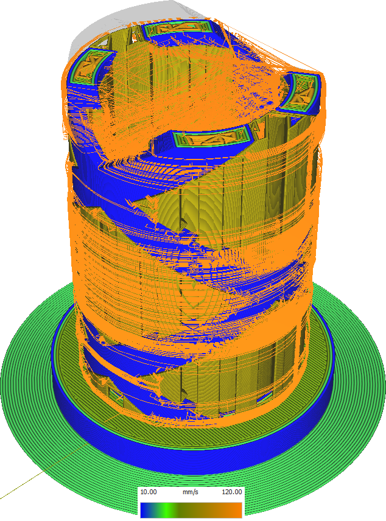

Inner Wall Speed
====
The speed at which the inner walls are printed can be configured separately from the normal print speed and the outer wall.

The inner walls are less important for visual quality than the outer walls. However they will influence the placement of the outer walls, causing the material for the outer walls to be pushed outside if the [outer wall is printed after the inner walls](../shell/outer_inset_first.md), or directly pushing the outer wall out if the outer wall is printed first. It is therefore still somewhat important to print the inner walls accurately, but they can be printed a bit faster than the outer walls in order to save time.

Reducing the speed of the inner wall will reduce vibrations while printing this structure, which reduces ringing. It also improves overhang, because the fans on the print head get more time to cool the material down while it's still being held taut by the nozzle.

If the inner wall printing speed is too low however, there is a risk of introducing too great of a flow change. If the nozzle suddenly has to extrude much more slowly, it will extrude a lot of material for a while while the pressure in the nozzle chamber drops, so at the beginning of the wall it will overextrude.

The inner walls are also a significant part of the printing time, so reducing the speed at which the inner walls are printed will drastically increase the printing time.