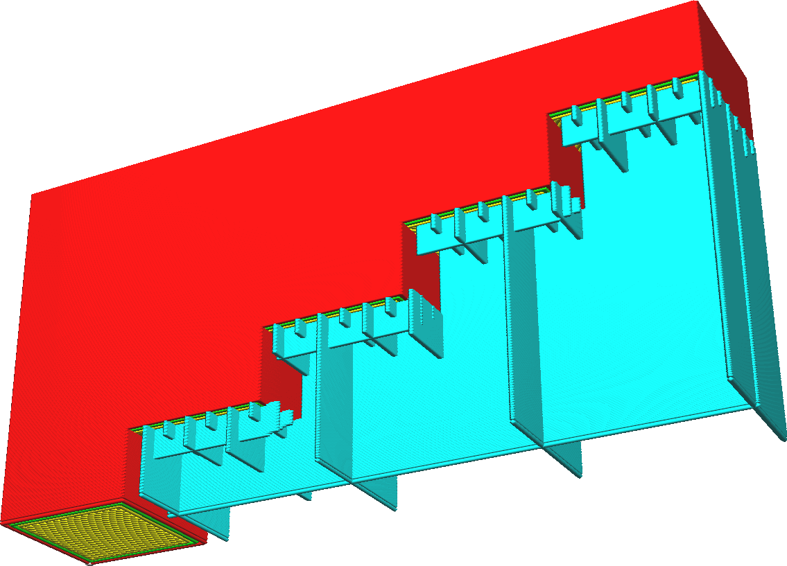

Gradual Support Infill Steps
====
Gradual support reduces the amount of support material used, by reducing the support density in the lower layers. This saves on printing time and material, while not reducing the overhang quality much. The primary purpose of support is to support overhanging areas. This feature focuses the support to that purpose only.

This setting indicates in how many steps the support density gets reduced. At every step, the support's density is halved. For example, starting at a density of 20% and two gradual support steps, the support density of the lower parts will be 10% and 5% respectively.

<!--screenshot {
"image_path": "gradual_support_infill_step_height_1mm.png",
"models": [
    {
        "script": "stair.scad",
        "transformation": ["rotateY(-90)", "scaleZ(0.5)"]
    }
],
"camera_position": [49, 91, -38],
"settings": {
    "support_enable": true,
    "support_pattern": "grid",
    "support_wall_count": 0,
    "support_infill_rate": 50,
    "gradual_support_infill_steps": 3,
    "gradual_support_infill_step_height": 1
},
"colours": 64
}-->

Increasing the number of steps cause the density to be halved more and more, resulting in lower density support. This saves a lot of material and printing time, but will make the support weaker.

Some of the support will be floating in mid-air. However in practice with most support patterns this will repair itself quickly as the layers can build up properly even on weakened lower layers. The intent of the [Gradual Support Infill Step Height](gradual_support_infill_step_height.md) is to allow sufficient time for the layers to repair themselves before the next gradual support step is piled on top.

This setting is best combined with at least one [Support Wall Line](support_wall_count.md). This gives the support lines something to hang on to, rather than being suspended in mid-air.