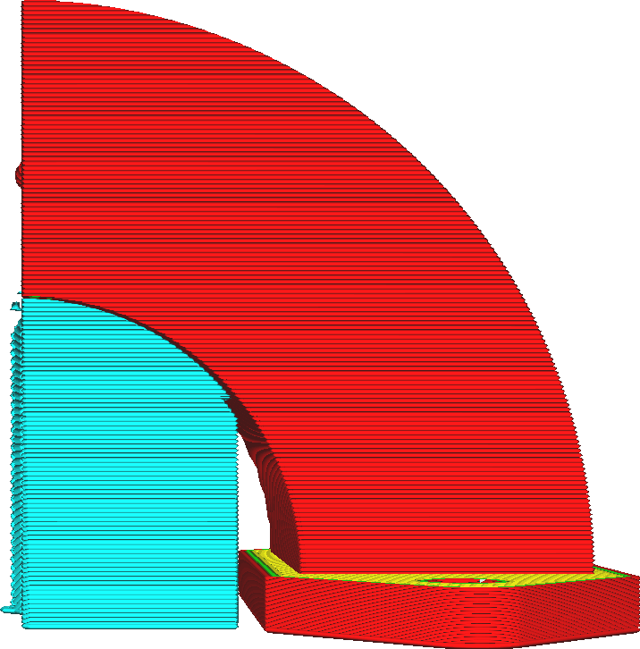
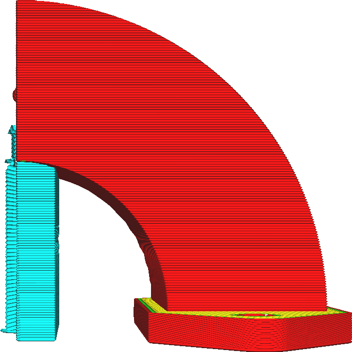
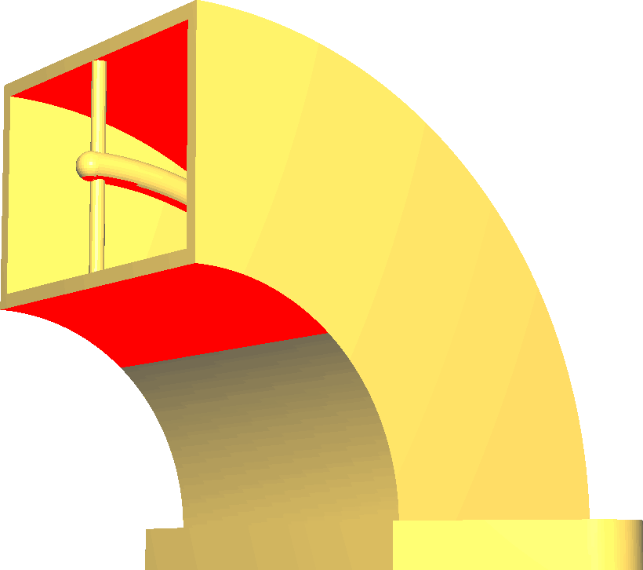

Support Overhang Angle
====
The overhang angle influences how much material is placed down to support the print. The angle indicates the minimum angle that gets supported.

**Reducing the value of this setting generates more support.**

<!--screenshot {
"image_path": "support_angle_low.png",
"models": [{"script": "duct.scad"}],
"camera_position": [136, 10, 10],
"camera_lookat": [0, 10, 10],
"settings": {
    "support_enable": true,
    "support_join_distance": 0.1,
    "support_angle": 40
},
"colours": 64
}-->
<!--screenshot {
"image_path": "support_angle_high.png",
"models": [{"script": "duct.scad"}],
"camera_position": [136, 10, 10],
"camera_lookat": [0, 10, 10],
"settings": {
    "support_enable": true,
    "support_join_distance": 0.1,
    "support_angle": 75
},
"colours": 64
}-->
<!--screenshot {
"image_path": "support_angle_prepare_mode.png",
"models": [{"script": "duct.scad"}],
"camera_position": [113, 77, 0],
"layer": -1
}-->

Reducing this setting makes the printer support more of the printed part, even surfaces that are steeper and won't sag much during printing. If the support is supporting parts that don't need to be supported, it'll increase the printing time and material usage unnecessarily and also create scars where the support touched the print.

However reducing the support angle is sometimes necessary to prevent the material from sagging too much. It generally improves the dimensional accuracy of the final part and makes the overhangs look better too.

Whenever working with support, it's a good idea to preview what the support looks like in the Preview stage. There you can see where it will actually generate support. Adjusting this setting is then one of the tools at your disposal to filter where precisely it will generate support.