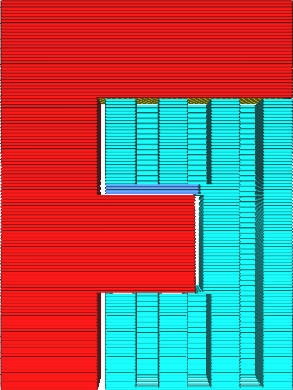

Enable Support Floor
====
The support floor is an intermediary structure between the support and the model where the support rests on the model. It can be used to provide a more stable base for the support or to make the support easier to remove from the print, leaving fewer scars.

<!--screenshot {
"image_path": "support_bottom_enable.png",
"models": [{"script": "f3.scad"}],
"camera_position": [0, 134, 20],
"settings": {
    "support_enable": true,
    "support_bottom_enable": true
},
"colours": 64
}-->

The support floor can be printed more slowly to get more stable support, or using a different material that is easier to remove from the model. This way, not all of the support needs to be printed with this material or these settings, which can save a lot of printing time.

**The support floor is not generated where the support rests on the build plate.**