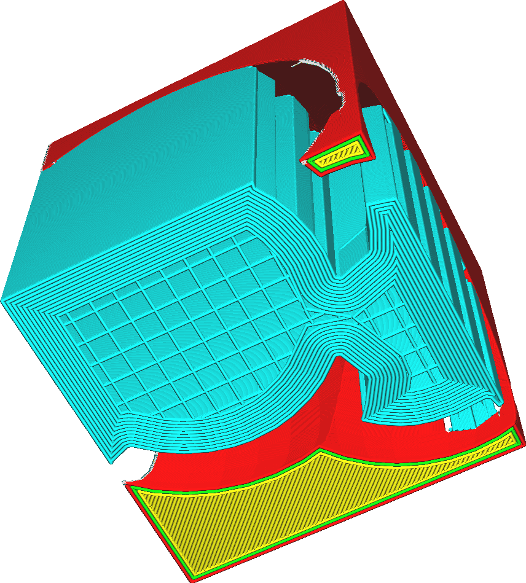

Enable Support Brim
====
When the support brim is activated, an additional brim will be drawn inside the support area on the first layer.

<!--screenshot {
"image_path": "support_brim_4mm.png",
"models": [{"script": "gazebo2.scad"}],
"camera_position": [-74, 38, -137],
"settings": {
    "support_enable": true,
    "support_use_towers": false,
    "support_brim_enable": true,
    "support_brim_width": 4
},
"colours": 64
}-->

The support brim is drawn towards the *inside*, unlike the ordinary brim. If the [Build Plate Adhesion Type](../platform_adhesion/adhesion_type.md) is set to Brim, another brim will also be drawn *around* the support.

The purpose of this brim is to give the support more surface area where it can adhere to the build plate. This can also be achieved by adjusting the [Initial Layer Support Line Distance](support_initial_layer_line_distance.md), but with this feature the adhesion will be concentrated around the edge of the support area, where it is more effective to prevent warping.

A support brim will also slightly increase the printing duration and material cost, but since it's only on the first layer this is very minimal. It does significantly make the support stronger, so for the zigzag support pattern it may become harder to break off.