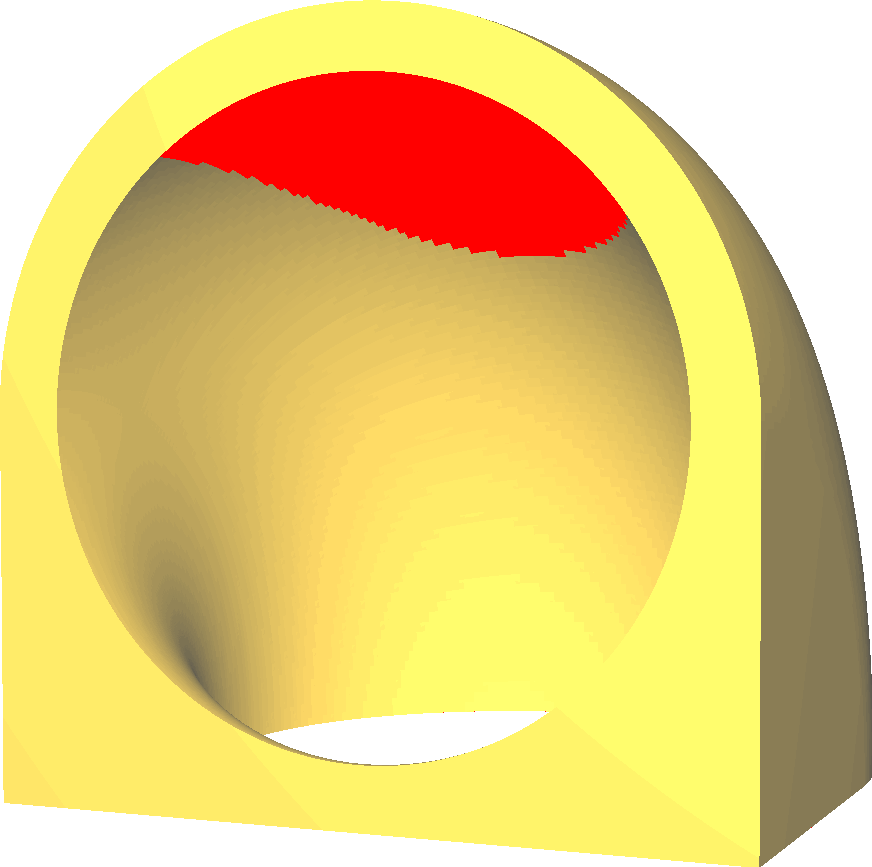
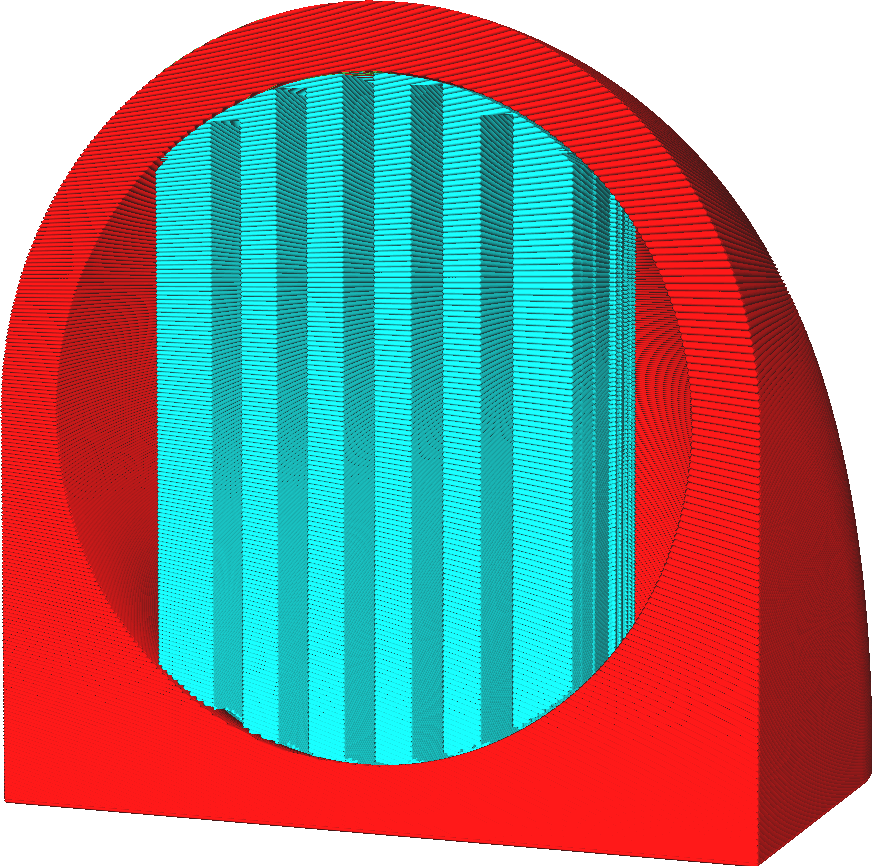

Generate Support
====
3D printers with fused-filament fabrication work by placing a string of molten plastic in the correct locations. If this plastic is not supported, it will sag down, because it gets pushed out the nozzle with significant force and because of gravity. Unless the model is beneath it to support the new layer, it will need to be supported by an additional support structure, that is removed and discarded after printing the model.

This setting enables creating support structures to support the object while it's being printed. Cura won't enable this support by default, but it will mark the surface of the model red if it thinks that the material there could sag a lot if support is not enabled.

<!--screenshot {
"image_path": "support_enable_prepare_mode.png",
"models": [{"script": "pipe_corner.scad"}],
"camera_position": [77, 197, 40],
"layer": -1
}-->
<!--screenshot {
"image_path": "support_enable.png",
"models": [{"script": "pipe_corner.scad"}],
"camera_position": [77, 197, 40],
"settings": {"support_enable": true},
"colours": 64
}-->

Printing support takes a significant amount of time and material. Where the support touches the model it needs to be broken or cut off later, after the print has completed. This tends to leave a scar on the surface.

However support is sometimes completely necessary. For instance, if the model has a piece that points down towards the build plate, this piece would otherwise just hang in mid-air.

Design for preventing support
----

While it is sometimes necessary, printing support should be prevented if at all possible. There are numerous techniques to prevent having to print support. This is a large part of model design for 3D printing. Here are a couple of techniques by which your 3D model can be altered to prevent needing support.
* Orient your model such that there are no flat surfaces higher than the build plate.
* Avoid designing overhangs as much as possible.
* If there is a surface just above your build plate, pull it down to the build plate.
* Small ledges can be supported with a 45 degree angle slope, transferring the overhang into the model.
* Larger overhangs can be bridged if they are supported on both sides. Cura will automatically orient the lines of the bottom side of that overhang such that they go in a straight line over the bridge. During the printing of these lines, the nozzle will keep tension on the bead such that it doesn't droop down. This then gives it enough time to solidify so that it can hold up on its own.
* If there is a gap in the overhang, a sacrificial bridge can be designed in. This is one layer in which the gap is closed. This allows for good bridging, such that the second layer can build the proper walls of the gap on top. After printing, the gap can be opened with a knife, since it's only one layer thick.