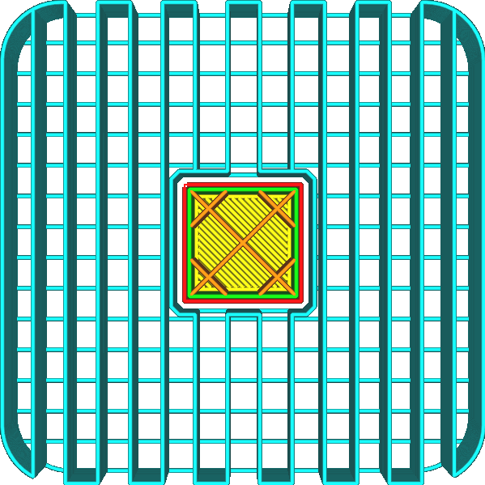
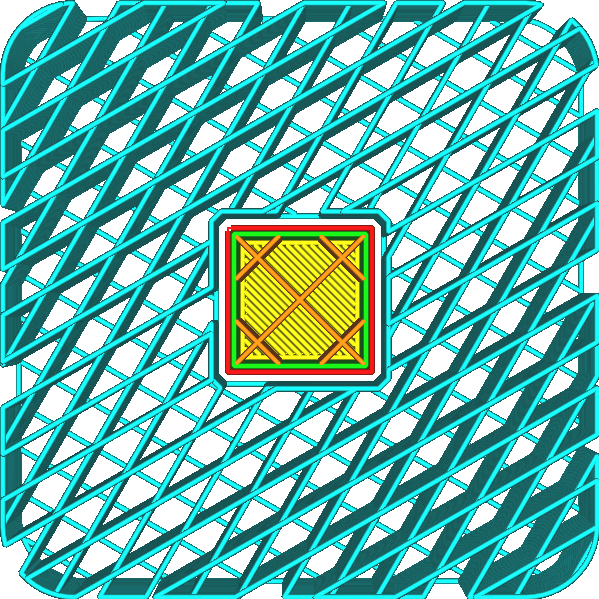

Support Infill Line Directions
====
The support pattern is normally oriented such that the lines are perpendicular to most things it supports. This way, the distance that the supported material has to bridge is minimised. With this setting, the orientation of the support lines can be customised.

<!--screenshot {
"image_path": "support_infill_angle_0.png",
"models": [{"script": "umbrella_square_rounded.scad"}],
"camera_position": [0, 0, 180],
"settings": {
    "support_enable": true,
    "support_infill_angles": [0]
},
"layer": 160,
"colours": 64
}-->
<!--screenshot {
"image_path": "support_infill_angle_30.png",
"models": [{"script": "umbrella_square_rounded.scad"}],
"camera_position": [0, 0, 180],
"settings": {
    "support_enable": true,
    "support_infill_angles": [30]
},
"layer": 160,
"colours": 64
}-->
<!--screenshot {
"image_path": "support_infill_angles.png",
"models": [{"script": "umbrella_square_rounded.scad"}],
"camera_position": [0, 0, 180],
"settings": {
    "support_enable": true,
    "support_infill_angles": [30, 60]
},
"layer": 160,
"colours": 64
}-->

This setting allows multiple angles to be entered, separated by commas. When multiple angles are entered, Cura will alternate between these angles over the layers.

If the [Top/Bottom Line Directions](../top_bottom/skin_angles.md) have been adjusted, it is wise to adjust the angle of the support accordingly, so that it is still perpendicular to the lines of the bottom side of the print. This allows these bottom lines to rest properly on the support, rather than falling in between support lines. This is particularly important for lines and zigzag [Support Patterns](support_pattern.md) where there are long straights between the support lines that don't provide any support.