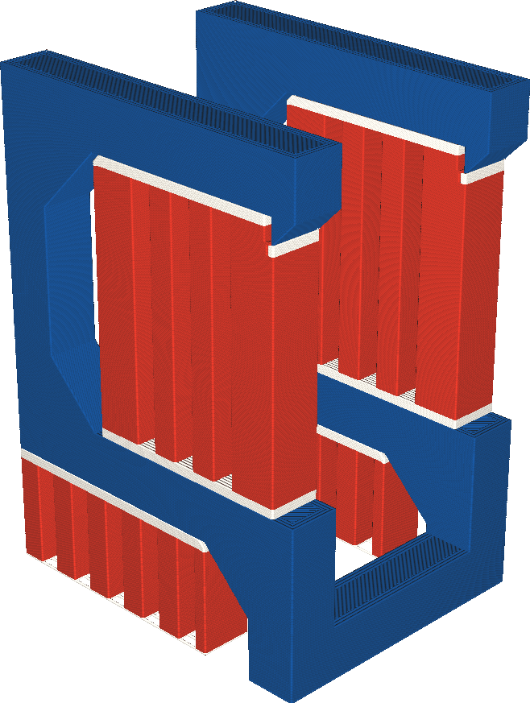

Support Infill Extruder
====
If your printer has multiple extruders, the main body of the support can be printed with a different extruder than the support interface. This setting allows you to choose which extruder is used for the main body of the support.

<!--screenshot {
"image_path": "support_infill_extruder_nr.png",
"models": [
    {
        "script": "question_stick_clip.scad",
        "transformation": ["rotateY(90)"],
        "object_settings": {"extruder_nr": 1}
    }
],
"camera_position": [134, 134, 113],
"settings": {
    "support_enable": true,
    "support_interface_enable": true,
    "support_use_towers": false,
    "support_extruder_nr": 3,
    "support_infill_extruder_nr": 2
},
"colour_scheme": "material_colour",
"colours": 64
}-->

Some materials are better suited for printing support than others, but those materials may be more expensive or slower to print as well. Printing just the interface with the expensive material but most of the body with a cheaper material can save a lot of time and money. The interface will still be printed with the expensive material, so the part that touches the model will look good or will be easier to break off, but most of the support will be printed with cheaper materials.

If you're using soluble materials to print the support interface, but insoluble materials to print the body of the support, keep in mind that the body may not be able to be removed from cavities if it's physically impossible to move the support body through a small opening. Where normally a soluble material can flow out through a cavity in solution, insoluble materials may not be able to go through.