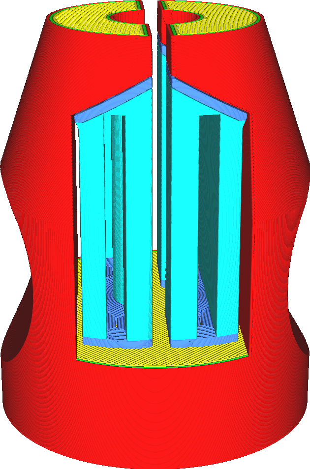

Support Join Distance
====
Thin pieces of support are generally not desirable. They are prone to topple over, which can ruin the print. When multiple pieces of support are adjacent to one another, they can be joined together, forming one piece of support that is much sturdier.

<!--screenshot {
"image_path": "support_join_distance_low.png",
"models": [{"script": "clamp.scad"}],
"camera_position": [-8, 150, 75],
"settings": {
    "support_enable": true,
    "support_interface_enable": true,
    "support_join_distance": 0.1
},
"colours": 64
}-->
<!--screenshot {
"image_path": "support_join_distance_high.png",
"models": [{"script": "clamp.scad"}],
"camera_position": [-8, 150, 75],
"settings": {
    "support_enable": true,
    "support_interface_enable": true,
    "support_join_distance": 2
},
"colours": 64
}-->

Joining support pieces together makes the support more sturdy and reliable. It also tends to reduce printing time, depending on the pattern. Many patterns require an extra wall to be printed around the complete perimeter or part of the perimeter, and joining two support pieces together reduces that perimeter.

Increasing this setting too much can cause support pieces that are very far away to be joined together. This can increase printing time and material usage.