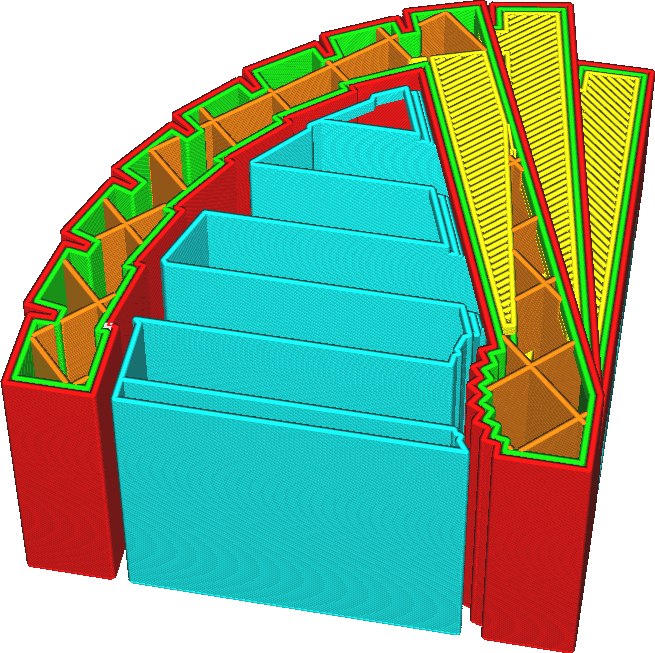
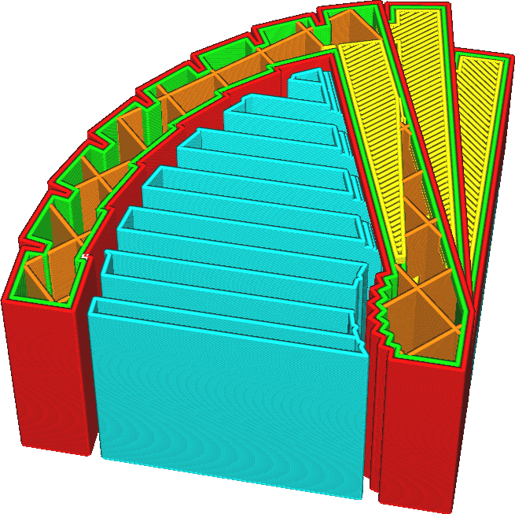

Support Line Distance
====
This setting defines the distance between two adjacent lines in the support pattern. This way of adjusting the density of support may be more intuitive than adjusting the density of support, since it directly adjusts the distance that the supported lines must bridge.

<!--screenshot {
"image_path": "support_infill_rate_low.png",
"models": [{"script": "spiral_stair.scad"}],
"camera_position": [-95, 18, 116],
"settings": {
    "support_enable": true,
    "support_infill_rate": 10
},
"layer": 256,
"colours": 64
}-->
<!--screenshot {
"image_path": "support_infill_rate_high.png",
"models": [{"script": "spiral_stair.scad"}],
"camera_position": [-95, 18, 116],
"settings": {
    "support_enable": true,
    "support_infill_rate": 20
},
"layer": 256,
"colours": 64
}-->

Reducing the distance between support lines has some positive and negative effects. Here are some of the effects that need to be weighed off:
* The surface resting on top of this support will sag less, because it has to bridge a smaller distance between two lines of support.
* The support will be stronger, improving reliability of the print.
* It's harder to remove the support due to the increased adhesion surface.
* It will take more material to print the support.
* The print will take longer to complete.