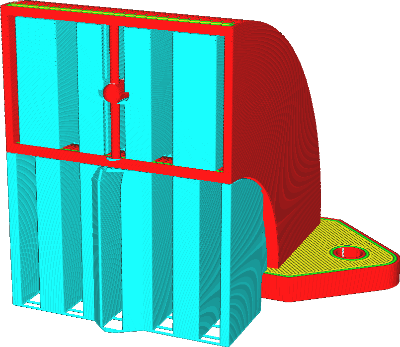
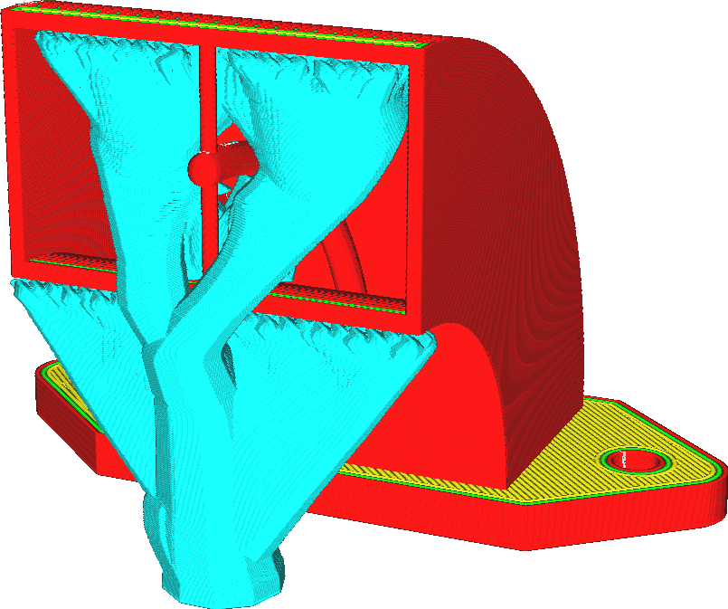

Support Structure
====
With this setting you can choose which algorithm to use to construct the support structures. These constructions have vastly different properties, so choosing an algorithm will have a big influence in how well your print gets supported. There are two options available.

<!--screenshot {
"image_path": "support_type_everywhere.png",
"models": [{"script": "duct.scad"}],
"camera_position": [56, 127, 60],
"settings": {
    "support_enable": true,
    "support_type": "everywhere"
},
"colours": 32
}-->
Normal
----

This is a traditional support structure, the one that most people are used to. The structure is generated underneath the overhanging areas, and typically filled with a pattern that directly supports the overhanging areas. From there it is dropped straight down until it reaches the build plate or a part of the model that supports it.

The normal support construction has been the default for most of 3D printing history, and works similarly in all slicers. This is the golden standard, and not without reason:
* Due to its sturdy structure, with big contact areas on the model and build plate, it is very reliable. It is very forgiving with bad settings or a badly tuned printer.
* Because the shape is simple, it is quick to slice.
* The straight support structure is easy to customise for a user, since it's immediately clear which borders are going to be supported and which are not.

The most important downsides arise from the same properties:
* Due to the large contact areas, the support is often hard to remove and can leave significant scars on the surface where it touched.
* Although it is stable, it can use a lot of material and take a lot of time to print. This can be counteracted to an extent by using [conical support](../experimental/conical_overhang_enabled.md).

Since the support will usually be large and wide, an [infill pattern](support_pattern.md) is needed to support the surface properly. The zig-zag infill pattern may be used to print the support largely out of a single line, and to allow for easier removal. Other patterns can be combined with an extra [outline](support_wall_count.md) to make the support extra sturdy instead.

<!--screenshot {
"image_path": "support_structure_tree.png",
"models": [{"script": "duct.scad"}],
"camera_position": [56, 127, 60],
"settings": {
    "support_enable": true,
    "support_structure": "tree",
    "support_tree_collision_resolution": 0.05
},
"colours": 32
}-->
Tree
----

With tree support, the support structure will start out small on the build plate, and will grow branches towards the parts of the print that need supporting.

Tree support can avoid obstacles when growing towards the overhang areas, since the support doesn't need to drop straight down. If at all possible, the support will rest only on the build plate, to prevent scarring of the surface that the support rests on. If no path exists from the build plate to the overhang, it will rest on a surface that is as close to the overhang as possible, to minimise material usage. The branches of tree support are limited by the [Tree Support Branch Angle](support_tree_angle.md) so that they don't produce too steep an overhang themselves. This limits the ability to grow around obstacles and also determines the height at which trunks will start branching out.

The tree support construction has a number of big advantages over normal support:
* Tree support often uses way less material than ordinary support. Between 25% and 50% of the material usage is common. This saves a lot of time and reduces the cost of the print.
* Because of its small contact area, overhang tends to look better when using tree support.
* Also because of the small contact area, the support will be easier to remove.
* It leaves fewer scars on the surface than normal support, due to being able to reach around the model from the build plate towards the overhang.

The main disadvantages are however:
* It takes significantly longer to slice than normal support. Patience will be necessary, especially with tall models.
* There are lots of interruptions in the flow when the smallest branches are printed, making tree support unsuitable to print using materials that are hard to extrude, such as PVA or flexible materials.
* Tree support doesn't work well to support some mechanical models. In particular, it tends to place too few branches to support flat, sloped overhangs.

Tree support is hollow by default. The branches will have a small tip, so an infill pattern doesn't provide extra support for the overhanging surface of the printed item. Due to its jagged shape, the tree support is normally quite sturdy. However the ordinary support settings still apply to the area circumscribed by the tree's branches. The [Support Density](support_infill_rate.md) can be used to give the support more structural strength.