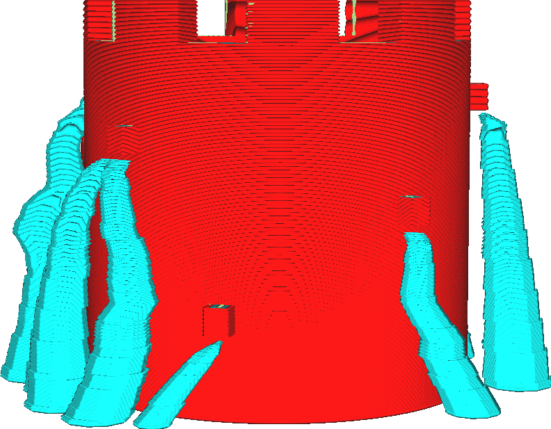
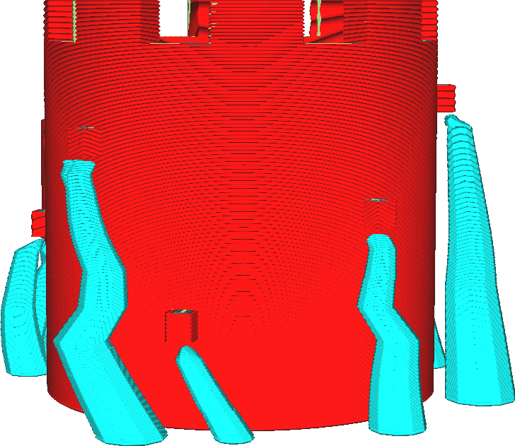

Tree Support Collision Resolution
====
A major disadvantage of tree support is that it takes a long time to slice when it is activated. Most of the calculations necessary for tree support are for the branches of the tree to avoid colliding with the mesh. This setting determines the accuracy of these collision avoidance calculations. Increasing this resolution (lower accuracy) will save a lot of time calculating, but will also make the support appear jagged when it's near the mesh.

<!--screenshot {
"image_path": "support_tree_collision_resolution_lo.png",
"models": [{"script": "castle_low.scad"}],
"camera_position": [-128, -63, 30],
"settings": {
    "z_seam_position": "backright",
    "support_enable": true,
    "support_structure": "tree",
    "support_tree_collision_resolution": 0.2
},
"colours": 32
}-->
<!--screenshot {
"image_path": "support_tree_collision_resolution_hi.png",
"models": [{"script": "castle_low.scad"}],
"camera_position": [-128, -63, 30],
"settings": {
    "z_seam_position": "backright",
    "support_enable": true,
    "support_structure": "tree",
    "support_tree_collision_resolution": 0.02
},
"colours": 32
}-->

The technical background of this setting is as follows. To avoid collisions with the printed object when tree support is enabled, Cura will calculate 3-dimensional volumes that the centres of the tree's branches are not allowed to enter. One such volume is calculated for every possible diameter of the tree's branches, which takes a lot of time. The number of possible branch diameters increases dramatically as the tree becomes taller and with large values for [Tree Support Branch Diameter Angle](support_tree_branch_diameter_angle.md). For this reason, the diameter is rounded to the nearest multiple of this resolution setting. However in some points along the tree's height, the collision volume the branch needs to avoid snaps to the next sample of a branch diameter, suddenly allowing more space for the branch to move. This makes the tree appear jagged.

Increasing this setting will make the slice take less time in Cura. It will also make the support more jagged which compromises its strength, increasing the chance that the support breaks off during printing which may cause the print to fail.