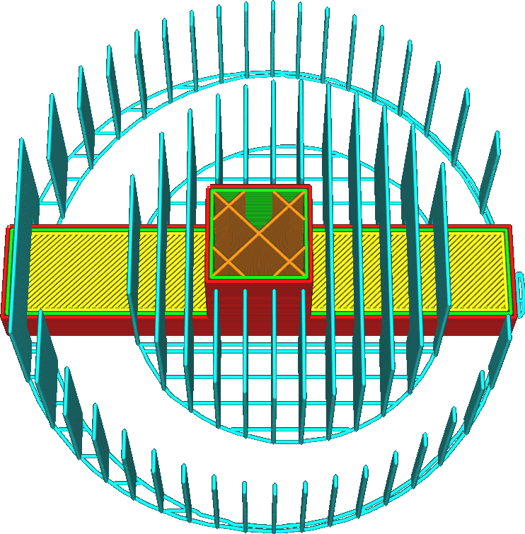
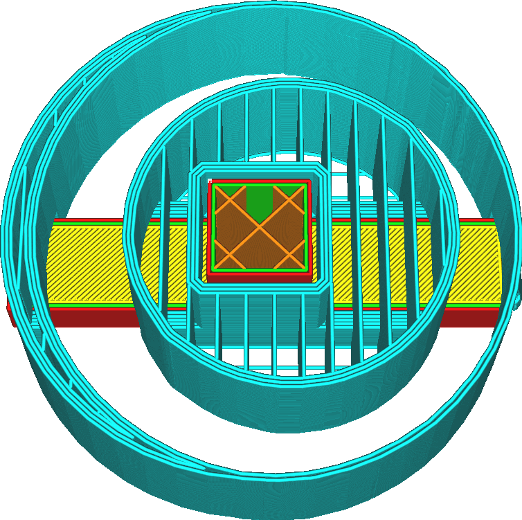

Support Wall Line Count
====
This setting adds a number of walls around the perimeter of the support.

<!--screenshot {
"image_path": "support_wall_count_0.png",
"models": [{"script": "plug.scad"}],
"camera_position": [0, 66, 169],
"settings": {
    "support_enable": true,
    "support_pattern": "lines",
    "support_offset": 0.2,
    "support_wall_count": 0
},
"layer": 236,
"colours": 64
}-->
<!--screenshot {
"image_path": "support_wall_count_3.png",
"models": [{"script": "plug.scad"}],
"camera_position": [0, 66, 169],
"settings": {
    "support_enable": true,
    "support_pattern": "lines",
    "support_offset": 0.2,
    "support_wall_count": 3
},
"layer": 236,
"colours": 64
}-->

The extra walls add strength to the support, reducing the chance that they topple over. It also allows the support to better support the very edges of the overhang area. For models with sharp corners, these edges tend to be problematic because lines end in mid-air there. This setting can make them end on a support line instead.

However the extra walls also take more time to print, use more material and make the support harder to remove from the object afterwards. When working with soluble support materials, the extra walls cause the support to take longer to dissolve because the solvent cannot enter the support structure from the side any more.