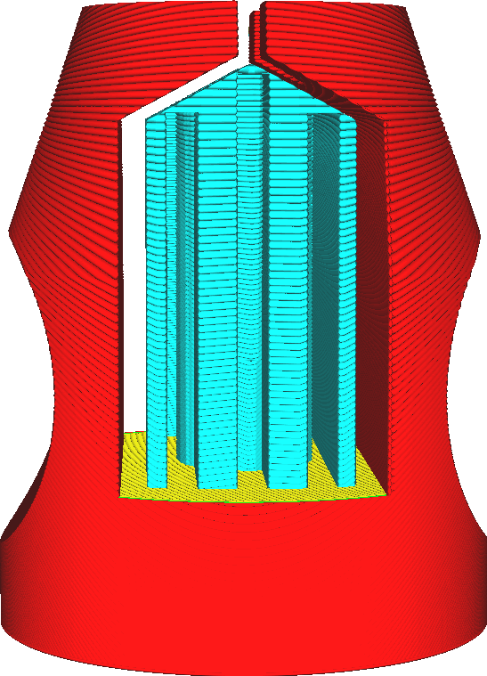

Support X/Y Distance
====
This indicates how much distance must be kept horizontally between the support and the model.

<!--screenshot {
"image_path": "support_xy_distance.png",
"models": [{"script": "clamp.scad"}],
"camera_position": [-8, 185, 42],
"settings": {
    "support_enable": true,
    "support_xy_overrides_z": true,
    "support_xy_distance": 2
},
"colours": 64
}-->

The horizontal distance is meant to prevent the support from hitting the model, where it would leave a scar on the surface. However, this also creates a larger distance between the model and the support structure where the overhang is, leaving smaller overhangs unsupported.

X/Y versus Z distance
----
Both the X/Y distance and the Z distance should be observed exactly; not more, not less. This is overconstrained, so there must be a preference between the two. This is indicated by the [Support Distance Priority](support_xy_overrides_z.md) setting. That setting changes the behaviour of this Support X/Y Distance setting.

If X/Y overrides Z, the X/Y distance is held, even if that means that the Z distance is too great. The Z distance is still held as minimum.

If Z overrides X/Y, the Z distance is held, even if that means that the X/Y distance is too small. The X/Y distance then only has any influence away from the top of the support where the Z distance has no influence.