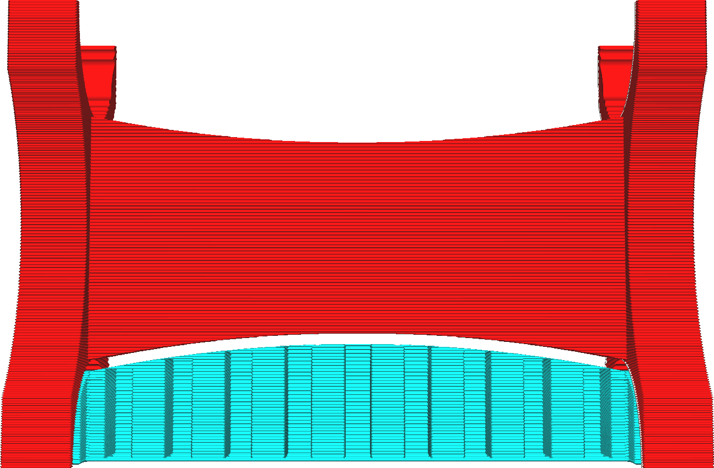

Support Z Distance
====
This setting indicates the vertical clearance that must be kept between the support and the model, both at the top of the support and the bottom.

<!--screenshot {
"image_path": "support_z_distance.png",
"models": [{"script": "rack.scad"}],
"camera_position": [0, 129, 11],
"settings": {
    "support_enable": true,
    "support_z_distance": 1
},
"colours": 32
}-->

This setting is the most influential factor in how well the support adheres to the model.

If this setting is reduced, the support will stick better to the model. This makes overhangs look better since they are not allowed to sag as much. It will also improve the stability of the support, because it is firmly positioned on top of the model at the bottom side of the support.

If this setting is increased, the support will be easier to remove. It won't leave as much of a scar on the surface where the support was supporting the model. On the other hand, the model won't be supported as well. This reduces the surface quality of the overhangs.

As a general rule, the better the support material sticks to the build material, the greater this setting must be. If you're using a different material to print the support, the Z distance can be lowered considerably since two different materials tend to separate more easily after solidifying. If you're using a material with good layer bonding, the setting must be increased a bit. Printing hotter or with thicker lines also increases bonding, and thus also require increasing this setting.