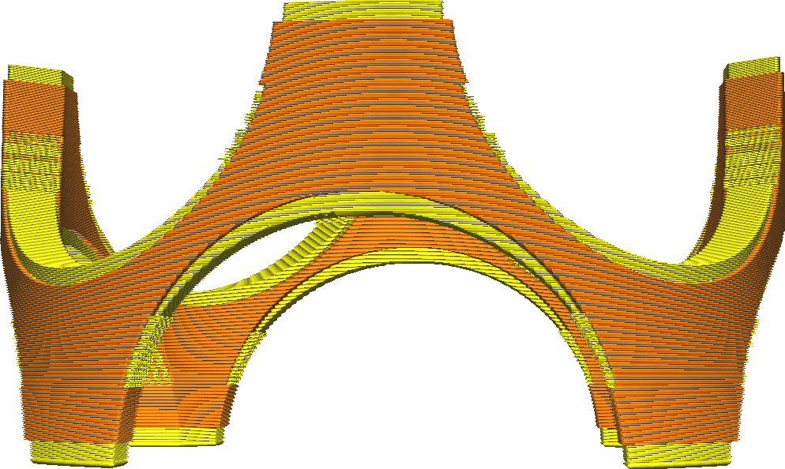

Bottom Skin Removal Width
====
Removes thin parts of the completely filled bottom layers, printing them with infill instead. This saves on printing time and material.

With steep surfaces the bottom layers will often become very thin. They are not necessary, since the horizontal strength of the walls is more than enough if the surface is almost completely vertical.

<!--screenshot {
"image_path": "skin_preshrink_original.png",
"models": [{"script": "stature_symmetrical.scad"}],
"camera_position": [104, -7, 4],
"settings": {
    "wall_line_count": 0,
    "infill_wall_line_count": 1,
    "bottom_skin_preshrink": 0,
    "top_skin_preshrink": 0
},
"colours": 32
}-->
<!--screenshot {
"image_path": "skin_preshrink_shrunk.png",
"models": [{"script": "stature_symmetrical.scad"}],
"camera_position": [104, -7, 4],
"settings": {
    "wall_line_count": 0,
    "infill_wall_line_count": 1,
    "bottom_skin_preshrink": 1,
    "top_skin_preshrink": 1
},
"colours": 32
}-->

Where the bottom side of your model has a very steep slope, the skin will become very thin. At this point, the horizontal [thickness of the walls](../shell/wall_thickness.md) is the most major contributor to the strength of the shell. Since the wall thickness should already be set such that strength is sufficient, it doesn't pay to add more material there. Leaving this skin material out saves a lot of printing time.

Increasing this setting too much may result in the bottom side of tiny pieces being open, because it gets filled with infill instead of skin.