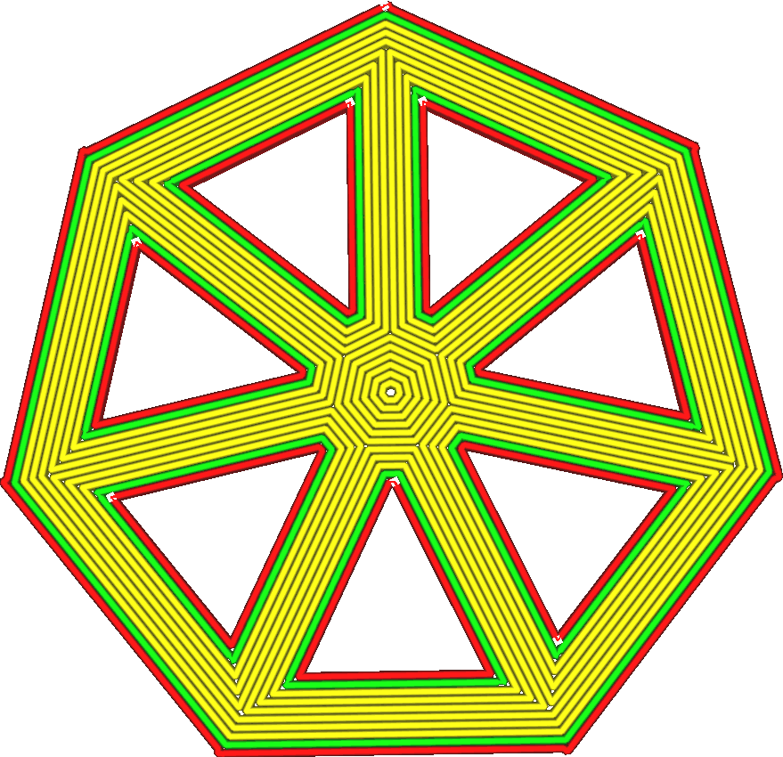
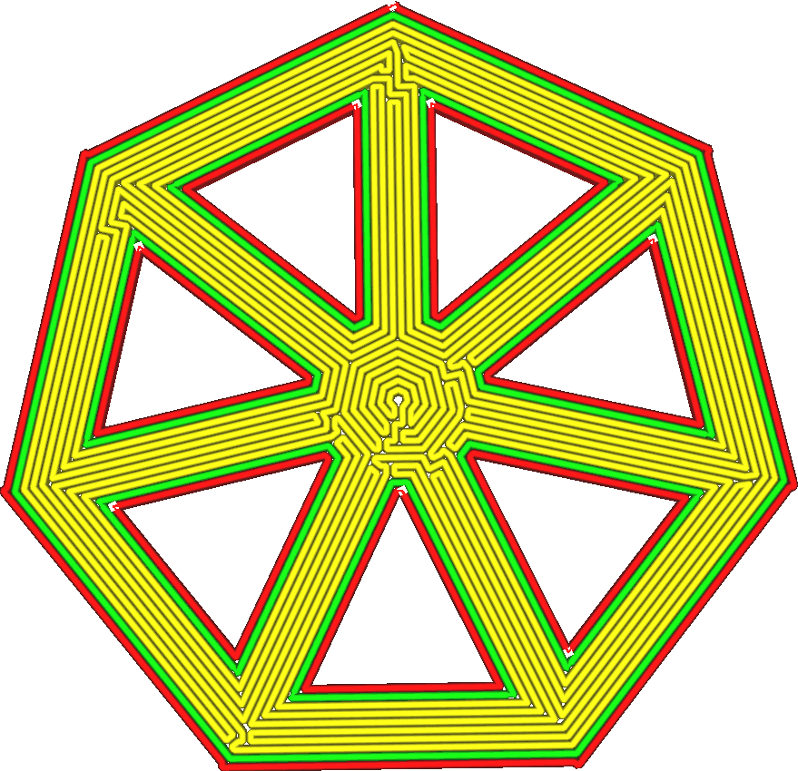

Connect Top/Bottom Polygons
====
When using a concentric top/bottom pattern (a pattern consisting of closed contours, otherwise known as polygons), connect all contours together such that they form one single path.

<!--screenshot {
"image_path": "connect_skin_polygons_original.png",
"models": [
    {
        "script": "web.scad",
        "scad_params": ["stakes=1", "line_width=4"]
    }
],
"camera_position": [10, 5, 111],
"settings": {
    "top_bottom_pattern": "concentric",
    "connect_skin_polygons": false
},
"colours": 64
}-->
<!--screenshot {
"image_path": "connect_skin_polygons_enabled.png",
"models": [
    {
        "script": "web.scad",
        "scad_params": ["stakes=1", "line_width=4"]
    }
],
"camera_position": [10, 5, 111],
"settings": {
    "top_bottom_pattern": "concentric",
    "connect_skin_polygons": true
},
"colours": 64
}-->

This prevents travel moves for the most part. However it creates new sharp corners where the nozzle will have to accelerate and decelerate a lot, which will offset against the win in printing time. The squiggly pattern will also be visible on the outside, which gives an interesting visual effect.

The contours created by [Extra Skin Wall Count](skin_outline_count.md) are not connected.