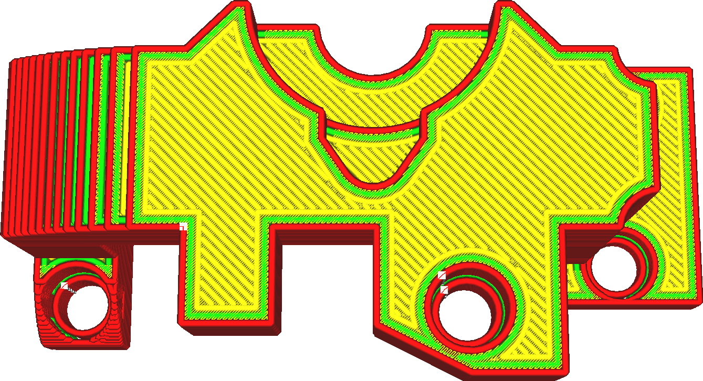
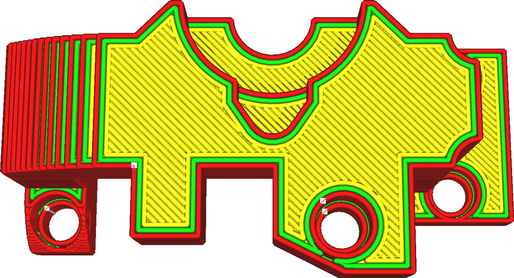

Ironing Inset
====
Ironing normally doesn't smooth all the way to the outer edge. If it did, the continuous pressure in the nozzle chamber would cause the material to flow over the edge, which causes a sort of ripple effect. This setting determines how far away from the edge the ironing will keep.

<!--screenshot {
"image_path": "ironing_enabled_enabled.png",
"models": [
    {
        "script": "dial_brace.scad",
        "transformation": ["scale(0.5)"]
    }
],
"camera_position": [0, 14, 83],
"settings": {
    "layer_height": 0.2,
    "ironing_enabled": true
},
"colours": 64
}-->
<!--screenshot {
"image_path": "ironing_inset.png",
"models": [
    {
        "script": "dial_brace.scad",
        "transformation": ["scale(0.5)"]
    }
],
"camera_position": [0, 14, 83],
"settings": {
    "layer_height": 0.2,
    "ironing_enabled": true,
    "ironing_inset": 1.2
},
"colours": 64
}-->

There are two main use cases for this setting:
* To make sure that the material does not get deposited over the edge.
* As a way to filter out thin strips that would normally get ironed. If you have a shallow slope then you might not want every layer-step in that slope to get ironed. Increasing this setting can filter out the thinnest strips, but will also cause the bigger parts to not get ironed all the way to the edge.