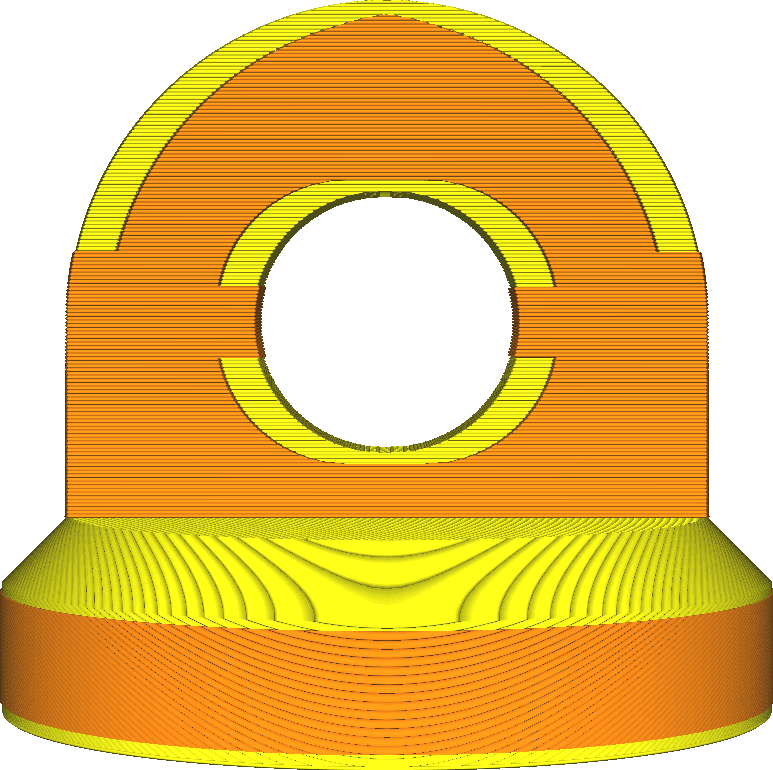

Maximum Skin Angle for Expansion
====
Since skin is present throughout the model, it is unnecessary to expand all of those areas. Rather, only the areas where the angle between the skin's surface and the horizon is less than this setting will get expanded. In that way, flat surfaces with protruding elements will be strengthened, without needlessly increasing printing time for the rest of the model.

<!--screenshot {
"image_path": "max_skin_angle_for_expansion_90.png",
"models": [{"script": "stamp.scad"}],
"camera_position": [0, 200, 30],
"settings": {
    "wall_line_count": 0,
    "infill_wall_line_count": 1,
    "expand_skins_expand_distance": 3,
    "max_skin_angle_for_expansion": 90
},
"colours": 64
}-->
<!--screenshot {
"image_path": "max_skin_angle_for_expansion_45.png",
"models": [{"script": "stamp.scad"}],
"camera_position": [0, 200, 30],
"settings": {
    "wall_line_count": 0,
    "infill_wall_line_count": 1,
    "expand_skins_expand_distance": 3,
    "max_skin_angle_for_expansion": 45
},
"colours": 64
}-->

Expanding the skin is useful for strengthening the connection between the top or bottom of the print and the walls on the sides. However it can also greatly increase the printing time and material usage. This setting allows you to filter out the material from the sides of the print where it is less useful for strengthening the connection between walls and skin.

For this setting, 0° is horizontal. If set to 0°, no skin gets expanded. 90° is vertical, and causes all skin areas to be expanded.