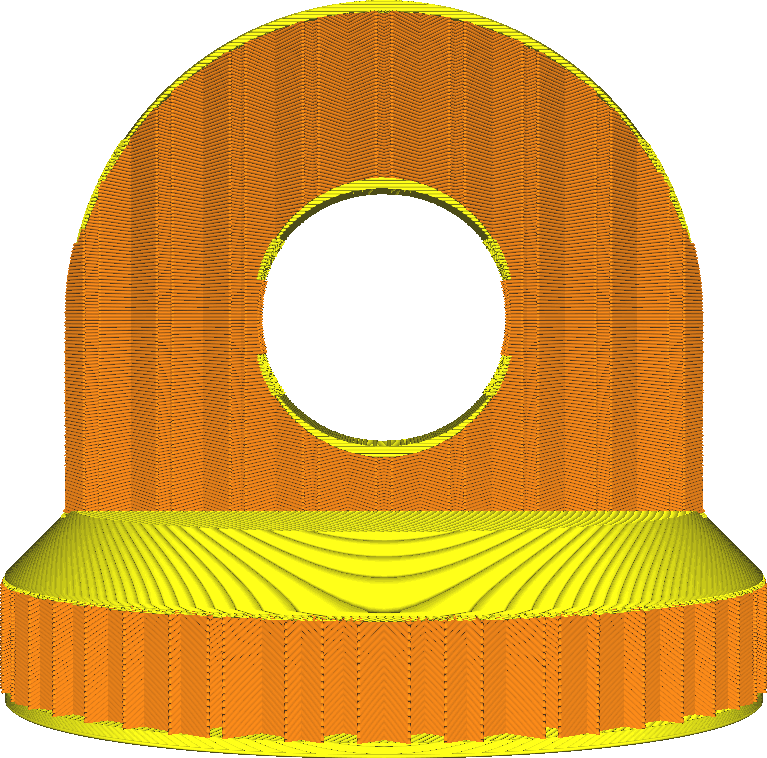
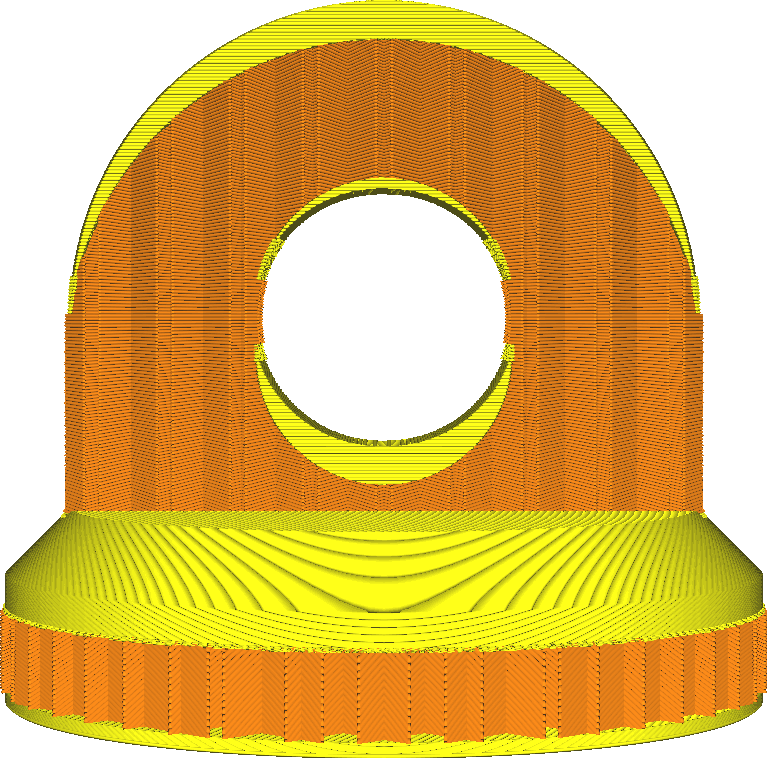

Top Layers
====
This setting configures how many solid layers are printed at the top side of the print. These solid layers are printed instead of the infill. They are intended to close the top side.

<!--screenshot {
"image_path": "top_bottom_thickness_0.8.png",
"models": [{"script": "stamp.scad"}],
"camera_position": [0, 203, 30],
"settings": {
    "wall_line_count": 0,
    "top_bottom_thickness": 0.8
},
"colours": 64
}-->
<!--screenshot {
"image_path": "top_thickness.png",
"models": [{"script": "stamp.scad"}],
"camera_position": [0, 203, 30],
"settings": {
    "wall_line_count": 0,
    "top_thickness": 3
},
"colours": 64
}-->

More top layers will have several effects, beneficial for the quality of the top surface but detrimental to productivity.
* Your part will be stronger. Having more top layers will mean that a smaller part of your print will get filled with the sparse infill pattern. Instead it gets made completely solid.
* The top surface will be smoother. Any pillowing and sagging in the top skin will get smoothed out in the layers put on top.
* It's more likely that your model will be water tight. More layers on the top side will be able to block water or other fluids from getting in, since more layers are filled completely.
* Your print will use more material, since more layers are filled completely.
* Your print will take longer, since more material must be placed down and these layers are normally printed more slowly than the infill.