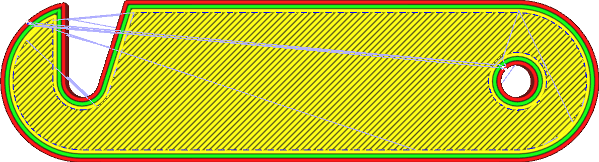
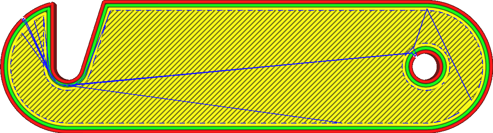

Combing Mode
====
Combing is the practice of avoiding crossing the walls of the print when travelling from one place to another. Crossing the walls tends to leave a scar on the surface where a hot nozzle exited or entered the volume of the print, so that is generally undesirable.

Combing alone just causes the nozzle to avoid the walls when travelling through the inside of the mesh. However it also allows for the [Avoid Printed Parts While Traveling](travel_avoid_other_parts.md) feature, which makes the nozzle avoid objects while outside of the volume as well.

<!--screenshot {
"image_path": "retraction_combing_off.png",
"models": [
    {
        "script": "safety_lock.scad",
        "scad_params": ["length=40"]
    }
],
"camera_position": [0, 0, 120],
"structures": ["travels", "helpers", "shell", "infill", "starts"],
"settings": {"retraction_combing": "off"},
"minimum_layer": 2,
"colours": 64
}-->
<!--screenshot {
"image_path": "retraction_combing_on.png",
"models": [
    {
        "script": "safety_lock.scad",
        "scad_params": ["length=40"]
    }
],
"camera_position": [0, 0, 120],
"structures": ["travels", "helpers", "shell", "infill", "starts"],
"settings": {"retraction_combing": "all"},
"minimum_layer": 2,
"colours": 64
}-->

If there is a path through the object from the start to the end location without hitting any walls, this path will be taken without making a retraction. If the start and end location are in completely separate paths, the nozzle will first move to the position where the two parts are closest together, then optionally retract (if [retractions are enabled](retraction_enable.md)), travel to the target path, optionally unretract, and then move through the new part to its final destination. In both parts it will avoid hitting the walls while travelling through the inside. When travelling from part to part it will only avoid parts when the [Avoid Printed Parts While Traveling](travel_avoid_other_parts.md) setting is enabled.

The objective of combing is to avoid going through the walls of the object, reducing the amount of scars in the surface. It will also reduce the stringing that is visible on the outside, because while the travel move is made it will still ooze, but this ooze is placed on the inside of the model. However combing will also increase the length of the travel move. Sometimes it needs to make a big detour.

These are the options in the drop-down for this setting:
* **Off**: Combing is disabled. Travel moves will always go directly to their target location. If this happens to not hit any walls, it will not retract.
* **All**: The nozzle will not hit any walls while travelling through the inside of the print, as described above.
<!--if cura_version >= 4.12-->* **Not on Outer Surface**: Aside from going around walls, the nozzle will avoid the highest and lowest layer of skin as well. These are the visible layers where you might see a scar on the surface if the nozzle were to pass over them. If it's not possible to avoid the surface, a retraction will be made.
* **Not in Skin**: The nozzle will avoid hitting any skin, if possible. While this option is still available from older Cura versions, it causes unnecessary retractions and longer travel paths compared to Not on Outer Surface, because it avoids skin layers even though the scar wouldn't be visible on the outside.<!--endif-->
<!--if cura_version < 4.12:* **Not in Skin**: The nozzle will avoid hitting the skin as well, if possible. This can reduce the scarring on the top side of the print by making the nozzle go along the walls rather than cutting through the skin. However in some cases the nozzle will not be able to escape and has to make a retraction, where otherwise it would have cut through the skin.-->
* **Within Infill**: The strictest mode of them all, this only allows combing through the infill. This makes it avoid hitting the inner walls as well as the outer walls, and also avoids hitting the skin. If the nozzle hits the inner walls, it may sometimes still be visible on the outside because the outside radius of the nozzle may be wider than the walls. This prevents that effect. However, it will need to make even more retractions because a path will often not be available.