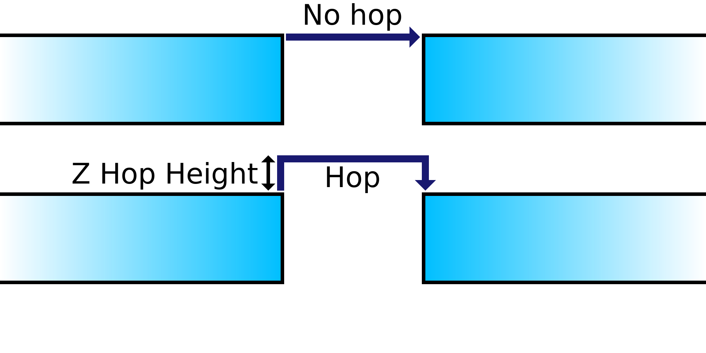

Z Hop Height
====
If a Z hop is performed, this setting determines how high the nozzle will move up before travelling to the destination.

Because Z-speed is up to 2 orders of magnitude slower than X/Y-speeds, Z hops can be time consuming.

Higher Z hops take more time to do, which can significantly increase the total printing time and slightly increases the amount of oozing as well,
However passing too low over the surface allows the ooze out of the nozzle to hit the model anyway, defeating the purpose of the Z hop.
