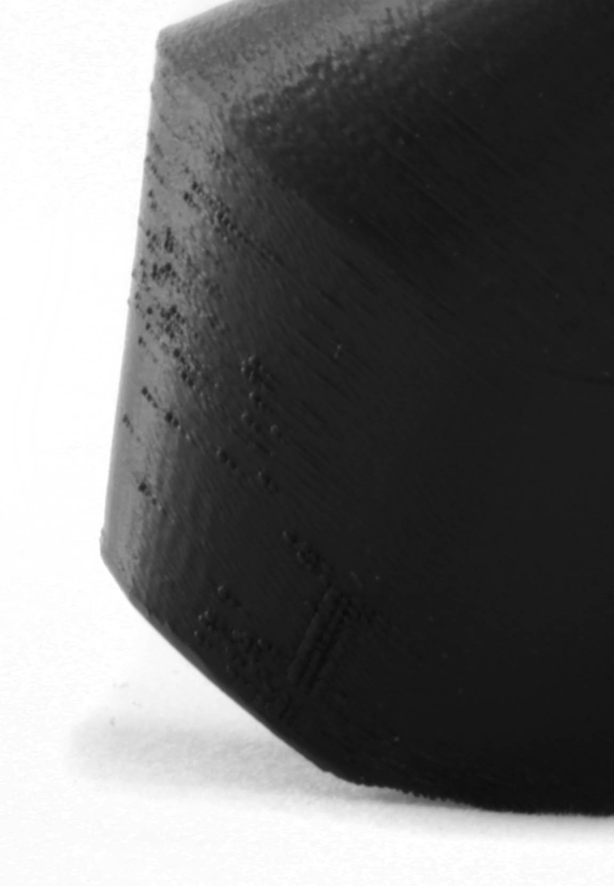

Blobs
====
Blobs are small specks on the side of the model. Sometimes they are just dots. Sometimes they are stripes. They are a visual surface defect and may increase friction between surfaces that need to slide over each other in a mechanism.

There are several possible causes for blobs. It's one of the most common defects in 3D printing. This article lists some possible causes and their solutions.

Nozzle slows down
----
If the nozzle moves slower in a certain track than in others, it will allow more material to be deposited there. This material flows outwards out the wall surface, forming a blob.

The feed of material was likely meant to be reduced with it. However even if the feeder moves slower, it can take a few seconds for the flow rate out the nozzle opening to be reduced accordingly. During that time, too much material will be extruded, which results in blobs.

To combat this, look at the following settings:
* Equalise the speed for the [outer wall](../speed/speed_wall_0.md) such that it's the same as whatever is printed before it (like the [inner walls](../speed/speed_wall_x.md) or [infill](../speed/speed_infill.md)). There will not be a slowdown then.
* Increase the [jerk rate during the outer wall](../speed/jerk_wall_0.md). This will prevent the nozzle from slowing down in corners.
* Reduce the [resolution](../meshfix/meshfix_maximum_resolution.md) and increase the [deviation](../meshfix/meshfix_maximum_deviation.md) to prevent the motion controller from slowing down the nozzle in order to keep up with the g-codes it needs to process.
* Disable the [Compensate Outer Wall Overlaps](../shell/travel_compensate_overlapping_walls_0_enabled.md) setting. This setting can create new movement commands with different feed rates. Disabling that feature reduces the number of movement commands in the wall.

Nozzle stands still
----
If the nozzle makes small pauses during the printing of the outer wall, it's most likely waiting for the processor in your 3D printer to process new movement commands. The printer's motion planner software typically keeps a buffer with pre-processed commands ready for such occasions, where the motion commands have already been processed so that the printer knows precisely the timings for the activation of the stepper motors or other motions. If this buffer runs out, this is called a "buffer underrun". This causes blobs to appear on the surface.

To prevent that, you need to reduce the resolution of the g-code.
* Increase the [Maximum Resolution](../meshfix/meshfix_maximum_resolution.md) setting, which makes Cura output longer line segments.
* Increase the [Maximum Deviation](../meshfix/meshfix_maximum_deviation.md) setting, which allows Cura to reduce the resolution further by deviating further from the original path.
* Disable the [Compensate Outer Wall Overlaps](../shell/travel_compensate_overlapping_walls_0_enabled.md) setting. If the outer wall overlaps with other outer walls, it would give part of the wall a different line width, but that needs an extra motion command. To reduce the motion commands, you can disable this. However this might also cause overextrusion in those walls, which causes blobs too.
* Reduce the [printing speed of the outer wall](../speed/speed_wall_0.md). This reduces the rate the movement commands need to be executed, allowing the CPU to catch up.

Travel moves through walls
----
While Cura will generally avoid crossing the outer wall as much as possible, sometimes this is unavoidable. If the nozzle carries some oozed material while it crosses an outer wall, this material can get wiped off there, leaving a blob.

This cause of blobs can be prevented by adjusting the following settings:
* Make sure that [combing](../travel/retraction_combing.md) is enabled. This makes the nozzle go around walls as much as possible, instead of through them.
* Enable [Z Hops](../travel/retraction_hop_enabled.md). If the walls are crossed, this will make the nozzle move up a bit, to go over the wall instead of through them. The oozed material will most likely not get wiped off on the wall, but where the nozzle lands after the travel move. Cura will always attempt to land in the infill or skin if possible.
* Make sure that [the wall printing order is optimised](../shell/optimize_wall_printing_order.md). This reduces the number of motions made while printing walls, allowing for more efficient motions and reducing the chance that some of these motions need to go through an outer wall.

Built up pressure
----
If the nozzle is overextruding, the extrusion can become irregular. This may sometimes suddenly find a way out when a particular nook of your print is printed (in particular at overhangs). Sometimes this pent-up pressure explodes out, leaving a big blob. Typically there will then be a stripe after the blob of gradually decreasing pressure.

To reduce this effect, here are a couple of settings to consider:
* Reduce the [wall line width](../resolution/wall_line_width.md). This reduces the pressure in the nozzle chamber in general.
* Reduce the [Outer Wall Inset](../shell/wall_0_inset.md). This setting makes the outer wall overlap with the adjacent inner wall, so that the wall gets pushed onto the inner wall harder, improving strength. However this pushing also increases the pressure inside the nozzle chamber.

Water inside the filament
----
If the filament has accumulated moisture while it was still on the spool, this water will get heated in the nozzle beyond its boiling point. The water vapour will explode out of the nozzle when it gets pushed out. This small explosion can blow some plastic out of the way, resulting in a small blob on your surface.

Seams
----
Where the perimeter of the outer wall is started and closed off, a seam will be created. This is not what people normally call a blob, though it looks similar. See the article on [seams](seam.md) on how to reduce this effect.

If the [Z Seam Alignment](../shell/z_seam_type.md) is set to "Random", the seam will be spread around the model, creating small seams everywhere. This can look exactly like a blob, even though it is actually a seam. Change the Z Seam Alignment setting to hide these seams.