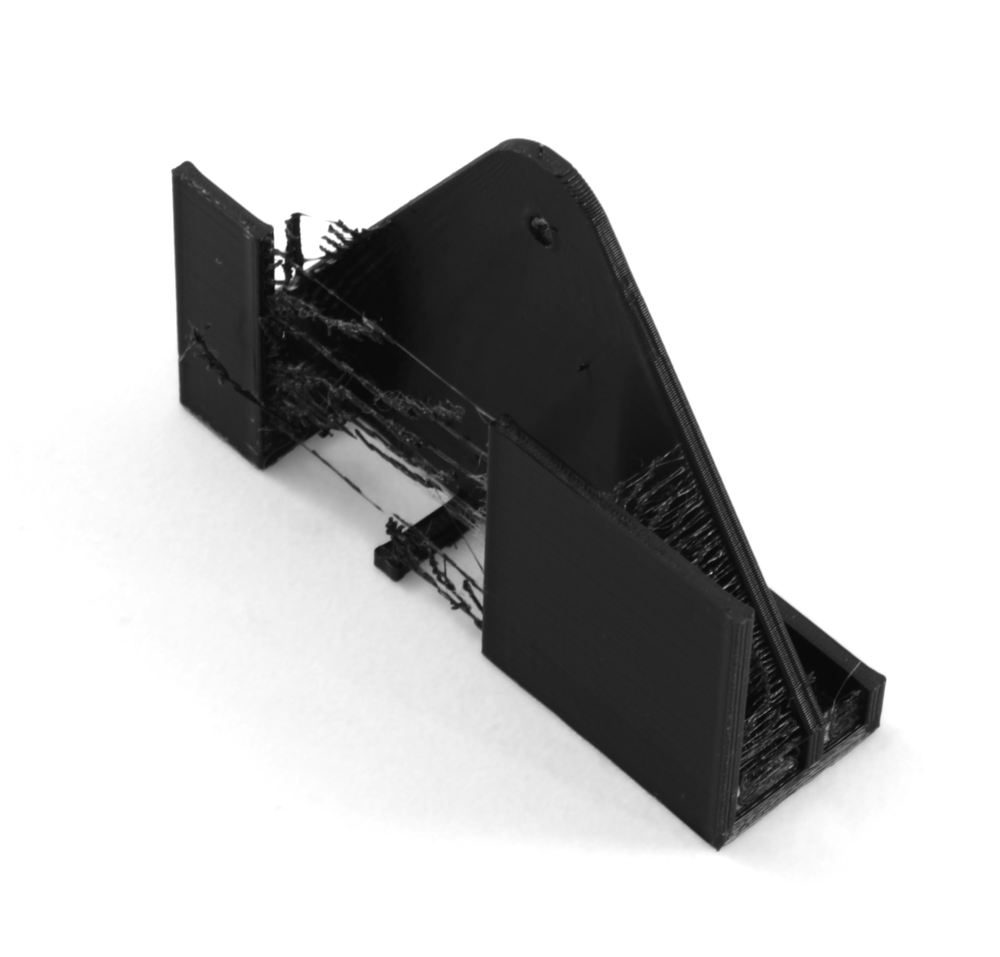

Stringing
====
When the printer is done printing one part of a layer and needs to move to a different part, it needs to temporarily stop extruding. If the material keeps flowing while it's traveling, a thin string of plastic is drawn between the two parts. This is called stringing.

Often the strings are aligned on top of each other, because the nozzle completes a part in the same spot on every layer. This creates a vertical webbing. The extra plastic can also bunch up on the stringing of previous layers, which results in messy blobs of plastic all over the place.

Stringing is sometimes accompanied with underextrusion. The slicer generally assumes that no material is lost during travel moves, and so instructs the printer to extrude just enough material to print its next part. If some material oozed out of the nozzle during a travel (which results in a string) that material won't get used in the printing of the next part, resulting in underextrusion there. Stringing is not normally a problem if it occurs inside the infill, but if the stringing is too extreme it can cause a problem even there because it results in underextrusion afterwards.

Causes
----
Stringing occurs because the material oozes out of the nozzle during a travel move. While the printer doesn't feed new material during a travel move, the flow of material doesn't stop immediately. During printing, there is some pressure inside the nozzle chamber caused by the filament building up a bit of force like a spring. When the nozzle moves through air, this pressure can release, unintendedly pushing the material out of the nozzle.

Even if the material is retracted before the travel move, there will still be some material inside the nozzle chamber. This happens because the material in that nozzle is molten. Pulling it back from one side doesn't pull the liquid back. Unless it's solidified, a bead of molten material remains in the nozzle. During a travel move, this bead will ooze out of the nozzle if it's runny enough.

Prevention
----
Retraction is the main technique to prevent stringing. If you're seeing some stringing in your prints, here are a few things that you could try:
* Make sure that [retraction is enabled at all](../travel/retraction_enable.md). This takes some extra printing time, but greatly reduces stringing.
* Reduce the [printing temperature](../material/material_print_temperature.md). This makes the material less runny, which makes it ooze less out of the nozzle. It also allows for more effective retractions, since more of the material will be pulled out of the nozzle chamber.
* If your material is viscous, increasing the [retraction speed](../travel/retraction_speed.md) will generally reduce stringing for short moves by placing an underpressure on the nozzle chamber. This reduced pressure keeps the material sucked in, so that it doesn't ooze out.
* For long travel moves, increasing the [retraction distance](../travel/retraction_amount.md) keeps the material in a colder location while the travel move is made, reducing the rate at which that material melts and oozes out of the nozzle.
* Sometimes, Cura will try to prevent wear on the filament by limiting the number of retractions over a certain length of filament. Because there are no retractions then, it will produce some stringing as a necessary evil rather than the print failing. If your feeder is not grinding the material too much, you can increase the [number of allowed retractions](../travel/retraction_count_max.md) or reduce the [length of filament](../travel/retraction_extrusion_window.md) along which it counts these retractions.
* Allowing [Combing](../travel/retraction_combing.md) in more locations will make the nozzle go through the inside of the model rather than through the outside. This doesn't actually prevent the stringing, but will make it invisible by placing it inside the model.
* If [the printing order of wall printing is better optimised](../shell/optimize_wall_printing_order.md) then the nozzle will move back and forth between parts less often, reducing the amount of stringing.
* Increasing the [travel speed](../speed/speed_travel.md) will generally make the strings thinner during longer travel moves. In short travel moves this really doesn't make much of a difference though, since the acceleration limits of the printers will prevent the nozzle from reaching those speeds anyway.
* Printing with a smaller nozzle will normally reduce stringing too. It's easier for the plastic to ooze out of a bigger nozzle.