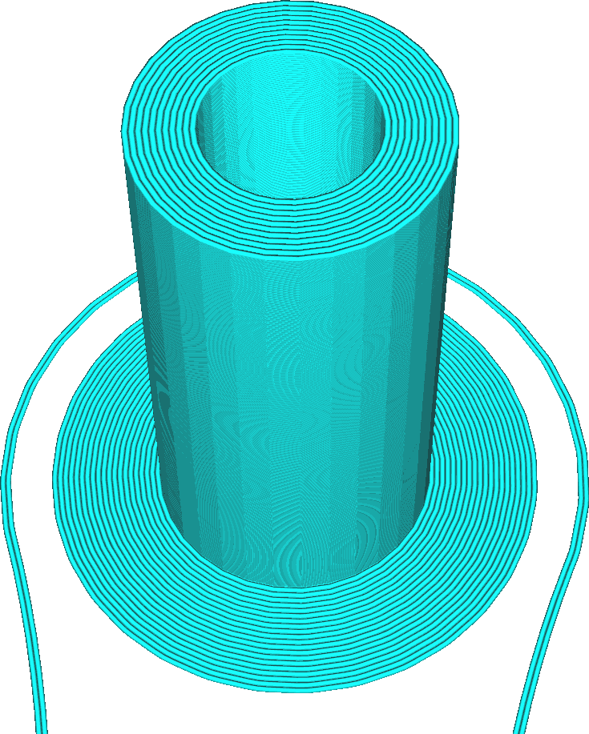

Brim primepijler 
====
De Primepijler Brim is een extra Brim, vergelijkbaar met de Brim-optie in de instelling [Type Hechting aan Platform](../platform_adhesion/adhesion_type.md). Deze brim kan afzonderlijk van de normale hechting worden geactiveerd en gedeactiveerd. Indien ingeschakeld, wordt er een extra marge geprint rond de primepijler. Deze brim is een platte laag rond de prime tower die de hechting van de primepijler aan de platvorm verbetert.

<!--screenshot {
"image_path": "prime_tower_brim_enable.png",
"modellen": [
    {
        "script": "cube.scad",
        "object_settings": {
            "extruder_no": 0
        }
    },
    {
        "script": "cube.scad",
        "object_settings": {
            "extruder_no": 1
        },
        "transformatie": ["translateX(40)"]
    }
],
"camerapositie": [50, -32, 133],
"camera_lookat": [93, -122, 5],
"instellingen": {
    "prime_tower_enable": waar,
    "prime_tower_brim_enable": waar,
    "prime_tower_position_x": 600,
    "prime_tower_position_y": 600,
    "adhesion_type": "rok"
},
"kleuren": 16
}-->

Door de brim van de prime pijler te activeren, krijgt de primepijler meer oppervlakte om op het platvorm te worden aangesloten. Omdat de primepijlern vrij hoog en slank kan worden, kan deze bij zeer hoge druk omvallen. De brim van de primepijler is bedoeld om dit te voorkomen, maar dit betekent een kleine investering in printtijd, materiaal en ruimte op de platvorm.

De primepijler brim krijgt de breedte die is gedefinieerd in de instelling [Breedte Brim](../platform_adhesion/brim_width.md). Wanneer het "Platformhechtingstype" is ingesteld op "Brim", verdubbelt deze instelling effectief de breedte van de brim rond de primepijler.
