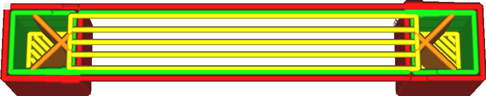

Dichtheid brugskin
====
Deze instelling regelt de dichtheid van de onderkant van de print waar deze een opening overbrugt. Bij 100% dichtheid worden de lijnen naast elkaar geplaatst. Bij lagere dichtheden liggen de lijnen verder uit elkaar.

<!--screenshot {
"image_path": "bridge_skin_density_100.png",
"modellen": [{"script": "bridge.scad"}],
"laag": 80,
"instellingen": {
    "bridge_settings_enabled": waar,
    "bridge_skin_density": 100,
    "bridge_skin_material_flow": 100,
    "bridge_wall_material_flow": 100
},
"camerapositie": [0, 18, 79],
"kleuren": 64
}-->
<!--screenshot {
"image_path": "bridge_skin_density_50.png",
"modellen": [{"script": "bridge.scad"}],
"laag": 80,
"instellingen": {
    "bridge_settings_enabled": waar,
    "bridge_skin_density": 50,
    "bridge_skin_material_flow": 100,
    "bridge_wall_material_flow": 100
},
"camerapositie": [0, 18, 79],
"kleuren": 64
}-->

Bij deze instelling spelen twee hoofdeffecten een rol: de hechting tussen de lijnen en de koeling.

Als je de lijnen van de skin vlak naast elkaar legt, blijven ze aan elkaar plakken. Hierdoor ziet de onderkant van de overbrugde opening er mooier uit omdat het oppervlak doorlopend is en er niet uitziet als een draad. Ook kan de tweede lijn bij het overbruggen een beetje tegen de eerste lijn aanleunen, waardoor de brug iets minder doorhangt.

Er is echter nog een ander effect: verkoeling. Als de lijnen verder uit elkaar staan, kunnen ze sneller afkoelen en verzakken ze minder. Dit geldt natuurlijk alleen als de ventilator aan staat; dus voor materialen met hoge temperaturen zal deze strategie niet werken.

Welke van deze effecten sterker is, hangt af van de viscositeit van het materiaal, hoe snel het stolt en de ventilatorsnelheid. Enige afstemming is altijd nodig.

**Als de instelling [Doorvoer brugskin](bridge_skin_material_flow.md) minder dan 100% is, zelfs bij 100% dichtheid, zal er enige afstand tussen de lijnen zijn omdat de lijnen dunner zijn.**